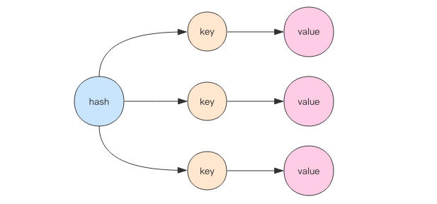
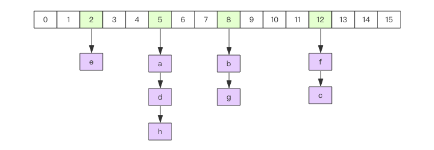
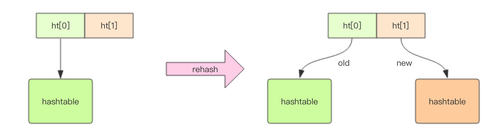
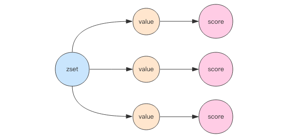
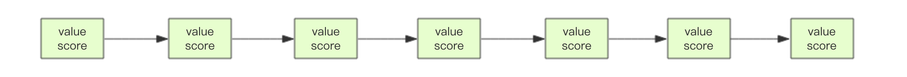
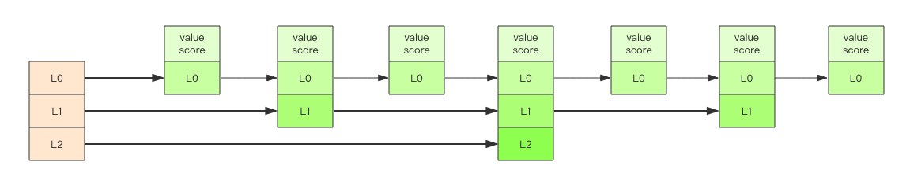

# what is redis

## definition
Redis 是互联网技术领域使用最为广泛的存储中间件，
它是「Remote Dictionary Service」的首字母缩写，也就是「远程字典服务」

## what is the using of redis
- 緩存
- 分布式鎖

## redis的數據結構
- string

    string表示的是一个可变的字节数组（python和go中的字符串是不可修改的），我们初始化字符串的内容、可以拿到字符串的长度，可以获取string的子串，可以覆盖string的子串内容，可以追加子串。
    
    
    Redis的字符串是动态字符串，是可以修改的字符串，内部结构实现上类似于Java的ArrayList，采用预分配冗余空间的方式来减少内存的频繁分配，
    如图中所示，内部为当前字符串实际分配的空间capacity一般要高于实际字符串长度len。
    当字符串长度小于1M时，扩容都是加倍现有的空间，
    如果超过1M，扩容时一次只会多扩1M的空间。需要注意的是字符串最大长度为512M。
    
    
    指令：
    - set key value [expiration EX seconds|PX milliseconds] [NX|XX]
    - get
    - mset key value [key value ...]
    - mget key [key ...]
    - strlen
    - getrange
    - setrange
    - append
    - incrby    -9223372036854775808 ~ 9223372036854775807
    - decrby
    - incr
    - decr
    - expire key seconds
    - ttl
    - del
    - exists key [key ...]
    - setnx key value
    - setex key seconds value
    
    字符串是由多个字节组成，每个字节又是由 8 个 bit 组成，如此便可以将一个字符串看成很多 bit 的组合，这便是 bitmap「位图」数据结构
    
- hash

    
    哈希等价于Java语言的HashMap或者是Python语言的dict，在实现结构上它使用二维结构，第一维是数组，第二维是链表，
    hash的内容key和value存放在链表中，数组里存放的是链表的头指针。
    
    通过key查找元素时，先计算key的hashcode，然后用hashcode对数组的长度进行取模定位到链表的表头，
    再对链表进行遍历获取到相应的value值，链表的作用就是用来将产生了「hash碰撞」的元素串起来。
    哈希的第一维数组的长度也是2^n。
    

    指令：
    - hset key field value
    - hget key field
    - hmset
    - hmget
    - hgetall key
    - hkeys
    - hvals
    - hdel
    - hexists
    - hincrby key field increment
    - hdecrby
    
    扩容 当hash内部的元素比较拥挤时(hash碰撞比较频繁)，就需要进行扩容。扩容需要申请新的两倍大小的数组，
    然后将所有的键值对重新分配到新的数组下标对应的链表中(rehash)。
    如果hash结构很大，比如有上百万个键值对，那么一次完整rehash的过程就会耗时很长。这对于单线程的Redis里来说有点压力山大。
    所以Redis采用了渐进式rehash的方案。它会同时保留两个新旧hash结构，在后续的定时任务以及hash结构的读写指令中将旧结构的元素逐渐迁移到新的结构中。
    这样就可以避免因扩容导致的线程卡顿现象。
    
    
    
    缩容 Redis的hash结构不但有扩容还有缩容，从这一点出发，它要比Java的HashMap要厉害一些，Java的HashMap只有扩容。
    缩容的原理和扩容是一致的，只不过新的数组大小要比旧数组小一倍。
    
    hash 结构也可以用来存储用户信息，不同于字符串一次性需要全部序列化整个对象，hash 可以对用户结构中的每个字段单独存储。
    这样当我们需要获取用户信息时可以进行部分获取。而以整个字符串的形式去保存用户信息的话就只能一次性全部读取，这样就会比较浪费网络流量。
    
    hash 也有缺点，hash 结构的存储消耗要高于单个字符串
    
- list

    Redis将列表数据结构命名为list而不是array，是因为列表的存储结构用的是链表而不是数组，而且链表还是双向链表。
    因为它是链表，所以随机定位性能较弱，首尾插入删除性能较优。如果list的列表长度很长，使用时我们一定要关注链表相关操作的时间复杂度。
    
    队列／堆栈 链表可以从表头和表尾追加和移除元素，结合使用rpush/rpop/lpush/lpop四条指令，可以将链表作为队列或堆栈使用，左向右向进行都可以
    
    指令：
    - rpush/rpop/lpush/lpop
    - llen
    - lindex key index  獲取指定索引位置的值
    - lrange
    - lset key index value  給指定索引位置賦予新值
    - linsert key BEFORE|AFTER pivot value  在指定值前或者後插入新值
    - lrem key count value  刪除列表中count個value值
    - ltrim key start stop  截取索引區間段內的值
    
    lindex 相当于 Java 链表的get(int index)方法，它需要对链表进行遍历，性能随着参数index增大而变差。
        
    快速列表
    
    如果再深入一点，你会发现Redis底层存储的还不是一个简单的linkedlist，而是称之为快速链表quicklist的一个结构。
    首先在列表元素较少的情况下会使用一块连续的内存存储，这个结构是ziplist，也即是压缩列表。
    它将所有的元素紧挨着一起存储，分配的是一块连续的内存。
    当数据量比较多的时候才会改成quicklist。因为普通的链表需要的附加指针空间太大，会比较浪费空间。
    比如这个列表里存的只是int类型的数据，结构上还需要两个额外的指针prev和next。
    所以Redis将链表和ziplist结合起来组成了quicklist。也就是将多个ziplist使用双向指针串起来使用。
    这样既满足了快速的插入删除性能，又不会出现太大的空间冗余。
    
- set

    Java程序员都知道HashSet的内部实现使用的是HashMap，只不过所有的value都指向同一个对象。
    Redis的set结构也是一样，它的内部也使用hash结构，所有的value都指向同一个内部值NULL。
    
    当集合中最后一个元素移除之后，数据结构自动删除，内存被回收。
    
    指令：
    - sadd key member [member ...]
    - smembers
    - scard key 獲取集合元素個數
    - srandmember key [count]  隨機獲取count個元素
    - srem key member [member ...]    刪除n個元素
    - spop key [count]  隨機刪除n個元素 
    - sismember key member  判斷元素是否存在
    
- SortedSet
    
    SortedSet(zset)是Redis提供的一个非常特别的数据结构，
    一方面它等价于Java的数据结构Map<String, Double>，可以给每一个元素value赋予一个权重score，
    另一方面它又类似于TreeSet，内部的元素会按照权重score进行排序，可以得到每个元素的名次，还可以通过score的范围来获取元素的列表。
    
    zset底层实现使用了两个数据结构，第一个是hash，第二个是跳跃列表，
    hash的作用就是关联元素value和权重score，保障元素value的唯一性，可以通过元素value找到相应的score值。
    跳跃列表的目的在于给元素value排序，根据score的范围获取元素列表。
    
    指令：
    - zadd key [NX|XX] [CH] [INCR] score member [score member ...]
    - zcard
    - zrem key member [member ...]
    - zincrby key increment member
    - zscore key member
    - zrank key member 獲取元素排名，返回的是名次（score從最小開始升序）
    - zrevrank  獲取元素倒序排名
    - zrange key start stop [WITHSCORES]    根據排名範圍獲取元素（score從最小開始升序）
    - zrerange  根據倒序排名範圍獲取元素
    - zrangebyscore key min max [WITHSCORES] [LIMIT offset count]     根据score范围获取列表
        ```
        127.0.0.1:6379> zrange ireader 0 -1 withscores
         1) "go"
         2) "2"
         3) "java"
         4) "8"
         5) "c"
         6) "99"
         7) "python"
         8) "103"
         9) "cpp"
        10) "966"
        127.0.0.1:6379> zrangebyscore ireader 99 +inf withscores limit 0 2
        1) "c"
        2) "99"
        3) "python"
        4) "103"
        127.0.0.1:6379> zrangebyscore ireader 99 +inf withscores limit 2 2
        1) "cpp"
        2) "966"
        ```

    - zrevrangebyscore key max min [WITHSCORES] [LIMIT offset count]
        ```shell script
          127.0.0.1:6379> zrangebyscore ireader 99 +inf withscores limit 2 2
          1) "cpp"
          2) "966"
          127.0.0.1:6379> zrevrangebyscore ireader 99 -inf withscores limit 0 2
          1) "c"
          2) "99"
          3) "java"
          4) "8"
          127.0.0.1:6379> zrevrangebyscore ireader 99 -inf withscores limit 2 2
          1) "go"
          2) "2"
        ```
    - zremrangebyrank key start stop 根據排名範圍刪除元素
    - zremrangebyscore key min max  根據score範圍刪除元素
        
    跳跃列表 
    
    zset内部的排序功能是通过「跳跃列表」数据结构来实现的，它的结构非常特殊，也比较复杂。    
    
    因为zset要支持随机的插入和删除，所以它不好使用数组来表示。
    
    
    我们需要这个链表按照score值进行排序。这意味着当有新元素需要插入时，需要定位到特定位置的插入点，这样才可以继续保证链表是有序的。
    通常我们会通过二分查找来找到插入点，但是二分查找的对象必须是数组，只有数组才可以支持快速位置定位，链表做不到，那该怎么办？
    
    跳跃列表就是类似于这种层级制，最下面一层所有的元素都会串起来。然后每隔几个元素挑选出一个代表来，再将这几个代表使用另外一级指针串起来。
    然后在这些代表里再挑出二级代表，再串起来。最终就形成了金字塔结构。(類似於mysql的b+樹索引)
    
    
    「跳跃列表」之所以「跳跃」，是因为内部的元素可能「身兼数职」，比如上图中间的这个元素，同时处于L0、L1和L2层，
    可以快速在不同层次之间进行「跳跃」。
    
    定位插入点时，先在顶层进行定位，然后下潜到下一级定位，一直下潜到最底层找到合适的位置，将新元素插进去。
    你也许会问那新插入的元素如何才有机会「身兼数职」呢？
    
    跳跃列表采取一个随机策略来决定新元素可以兼职到第几层，
    首先L0层肯定是100%了，L1层只有50%的概率，L2层只有25%的概率，L3层只有12.5%的概率，一直随机到最顶层L31层。
    绝大多数元素都过不了几层，只有极少数元素可以深入到顶层。列表中的元素越多，能够深入的层次就越深，能进入到顶层的概率就会越大。
    
- HyperLogLog
- geo
- pub/sub
- BloomFilter
- RedisSearch
- Redis-ML

### 容器型数据结构的通用规则
list/set/hash/zset 这四种数据结构是容器型数据结构，它们共享下面两条通用规则：

- create if not exists

    如果容器不存在，那就创建一个，再进行操作。比如 rpush 操作刚开始是没有列表的，Redis 就会自动创建一个，然后再 rpush 进去新元素。

- drop if no elements

    如果容器里元素没有了，那么立即删除元素，释放内存。这意味着 lpop 操作到最后一个元素，列表就消失了。

## 應用
### 分布式鎖如何使用redis實現？
setnx + expire

如何防止在setnx之后执行expire之前进程意外crash或者要重启维护了，導致鎖得不到釋放？

答案：set的複雜參數 todo

set key value [expiration EX seconds|PX milliseconds] [NX|XX]


### 假如Redis里面有1亿个key，其中有10w个key是以某个固定的已知的前缀开头的，如果将它们全部找出来？
使用keys指令可以扫出指定模式的key列表。

如果这个redis正在给线上的业务提供服务，那使用keys指令会有什么问题？

redis的单线程的。keys指令会导致线程阻塞一段时间，线上服务会停顿，直到指令执行完毕，服务才能恢复。
这个时候可以使用scan指令，scan指令可以无阻塞的提取出指定模式的key列表，但是会有一定的重复概率，
在客户端做一次去重就可以了，但是整体所花费的时间会比直接用keys指令长。

### 使用过Redis做异步队列么，你是怎么用的？
一般使用list结构作为队列，rpush生产消息，lpop消费消息。当lpop没有消息的时候，要适当sleep一会再重试。

可不可以不用sleep呢？

list还有个指令叫blpop，在没有消息的时候，它会阻塞住直到消息到来。

能不能生产一次消费多次呢？

使用pub/sub主题订阅者模式，可以实现1:N的廣播消息队列。

pub/sub有什么缺点？

在消费者下线的情况下，生产的消息会丢失，得使用专业的消息队列如rabbitmq，nats等，那樣消息可以實現序列化存儲。

redis如何实现延时队列？

使用sortedset，拿时间戳作为score，消息内容作为key调用zadd来生产消息，
消费者用zrangebyscore指令获取N秒之前的数据轮询进行处理。

### 如果有大量的key需要设置同一时间过期，一般需要注意什么？
如果大量的key过期时间设置的过于集中，到过期的那个时间点，redis可能会出现短暂的卡顿现象。
一般需要在时间上加一个随机值，使得过期时间分散一些。

### Redis如何做持久化的？
bgsave做镜像全量持久化，aof做增量持久化。因为bgsave会耗费较长时间，不够实时，在停机的时候会导致大量丢失数据，所以需要aof来配合使用。
在redis实例重启时，优先使用aof来恢复内存的状态，如果没有aof日志，就会使用rdb文件来恢复。

aof文件过大恢复时间过长怎么办？

Redis会定期做aof重写，压缩aof文件日志大小。
Redis4.0之后有了混合持久化的功能，将bgsave的全量和aof的增量做了融合处理，这样既保证了恢复的效率又兼顾了数据的安全性。

如果突然机器掉电会怎样？

取决于aof日志sync属性的配置，如果不要求性能，在每条写指令时都sync（同步）一下磁盘，就不会丢失数据。
但是在高性能的要求下每次都sync是不现实的，一般都使用定时sync，比如1s1次，这个时候最多就会丢失1s的数据。

bgsave的原理是什么？

fork和cow。
fork是指redis通过创建子进程来进行bgsave操作，
cow指的是copy on write，
子进程创建后，父子进程共享数据段，父进程继续提供读写服务，写脏的页面数据会逐渐和子进程分离开来。

### Pipeline有什么好处，为什么要用pipeline？
可以将多次IO往返的时间缩减为一次，前提是pipeline执行的指令之间没有因果相关性。

使用redis-benchmark进行压测的时候可以发现影响redis的QPS峰值的一个重要因素是pipeline批次指令的数目。

### Redis的同步机制了解么？
Redis可以使用主从同步，从从同步。
第一次同步时，主节点做一次bgsave，并同时将后续修改操作记录到内存buffer，
待bgsave完成后将rdb文件全量同步到复制节点，复制节点接受完成后将rdb镜像加载到内存。
复制加载完成后，再通知主节点将期间修改的操作记录同步到复制节点进行重放就完成了同步过程。

### 是否使用过Redis集群，集群的原理是什么？
Redis Sentinal着眼于高可用，在master宕机时会自动将slave提升为master，继续提供服务。

Redis Cluster着眼于扩展性，在单个redis内存不足时，使用Cluster进行分片存储。


