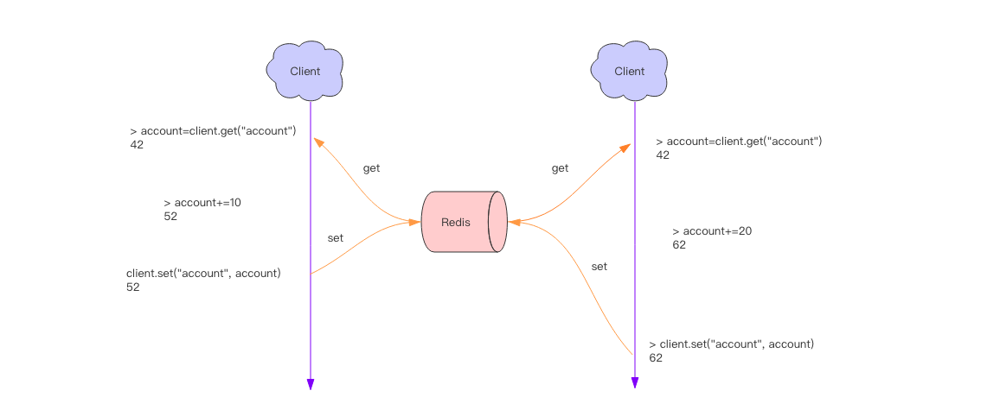
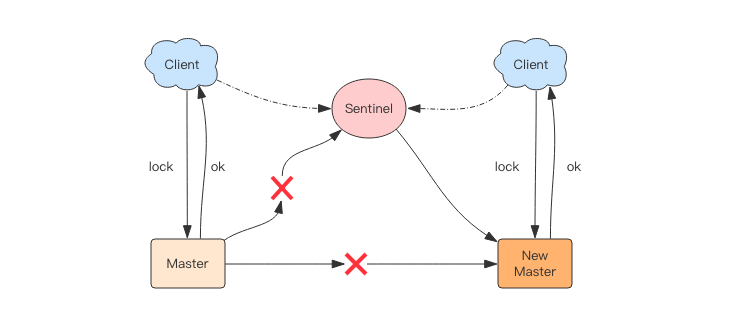
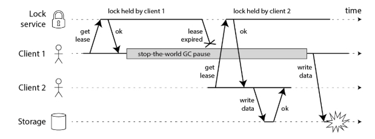
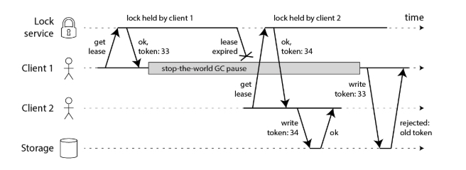

# lock


## 原子操作
分布式应用进行逻辑处理时经常会遇到并发问题。

比如一个操作要修改用户的状态，修改状态需要先读出用户的状态，在内存里进行修改，改完了再存回去。
如果这样的操作同时进行了，就会出现并发问题，因为读取和保存状态这两个操作不是原子的。
（Wiki 解释：所谓原子操作是指不会被线程调度机制打断的操作；这种操作一旦开始，就一直运行到结束，中间不会有任何 context switch 线程切换。）


这个时候就要使用到分布式锁来限制程序的并发执行。

## 分布式锁
### 锁释放的问题

    > setnx lock:codehole true
    OK
    > expire lock:codehole 5
    ... do something critical ...
    > del lock:codehole
    (integer) 1
    
但是以上逻辑还有问题。如果在 setnx 和 expire 之间服务器进程突然挂掉了，可能是因为机器掉电或者是被人为杀掉的，
就会导致 expire 得不到执行，也会造成死锁。    

Redis 2.8 版本中作者加入了 set 指令的扩展参数，使得 setnx 和 expire 指令可以一起执行

    > set lock:codehole true ex 5 nx
    OK
    ... do something critical ...
    > del lock:codehole

### 超时问题
Redis 的分布式锁不能解决超时问题，如果在加锁和释放锁之间的逻辑执行的太长，以至于超出了锁的超时限制，就会出现问题。

因为这时候第一个线程持有的锁过期了，临界区的逻辑还没有执行完，这个时候第二个线程就提前重新持有了这把锁，导致临界区代码不能得到严格的串行执行。

- 为了避免这个问题，Redis 分布式锁不要用于较长时间的任务。如果真的偶尔出现了，数据出现的小波错乱可能需要人工介入解决。

- 有一个稍微安全一点的方案是为 set 指令的 value 参数设置为一个随机数，释放锁时先匹配随机数是否一致，然后再删除 key，
    这是为了确保当前线程占有的锁不会被其它线程释放，除非这个锁是过期了被服务器自动释放的。
    
    但是匹配 value 和删除 key 不是一个原子操作，Redis 也没有提供类似于delifequals这样的指令，这就需要使用 Lua 脚本来处理了，
    因为 Lua 脚本可以保证连续多个指令的原子性执行。
    
    ````
    tag = random.nextint()  # 随机数
    if redis.set(key, tag, nx=True, ex=5):
        do_something()
        redis.delifequals(key, tag)  # 假想的 delifequals 指令
    
    # delifequals
    if redis.call("get",KEYS[1]) == ARGV[1] then
        return redis.call("del",KEYS[1])
    else
        return 0
    end
    ````
## 可重入性
可重入性是指线程在持有锁的情况下再次请求加锁，如果一个锁支持同一个线程的多次加锁，那么这个锁就是可重入的。
```shell script
pip install redis
# 代碼參考  ./reentrant_lock.py
```

## 集群下的分布式鎖實現
比如在 Sentinel 集群中，主节点挂掉时，从节点会取而代之，客户端上却并没有明显感知。
原先第一个客户端在主节点中申请成功了一把锁，但是这把锁还没有来得及同步到从节点，主节点突然挂掉了。
然后从节点变成了主节点，这个新的节点内部没有这个锁，所以当另一个客户端过来请求加锁时，立即就批准了。
这样就会导致系统中同样一把锁被两个客户端同时持有，不安全性由此产生。

不过这种不安全也仅仅是在主从发生 failover 的情况下才会产生，而且持续时间极短，业务系统多数情况下可以容忍。

### Redlock 算法
为了解决这个问题，Antirez 发明了 Redlock 算法，它的流程比较复杂，不过已经有了很多开源的 library 做了良好的封装，
用户可以拿来即用，比如 redlock-py```pip install redlock```。
```shell script
# 啟動多個redis實例，这些实例之前相互独立没有主从关系
docker run \
 -p 6479:6379 \
 -v $PWD/data:/data \
 --name redis2 \
 --restart=always \
 -d redis redis-server --appendonly yes

docker run \
 -p 6579:6379 \
 -v $PWD/data:/data \
 --name redis3 \
 --restart=always \
 -d redis redis-server --appendonly yes
```

加锁时，它会向过半节点发送 set(key, value, nx=True, ex=xxx) 指令，只要过半节点 set 成功，那就认为加锁成功。
释放锁时，需要向所有节点发送 del 指令。不过 Redlock 算法还需要考虑出错重试、时钟漂移等很多细节问题，
同时因为 Redlock 需要向多个节点进行读写，意味着相比单实例 Redis 性能会下降一些。

### redlock的不足

在此示例中，获取锁的客户端在持有锁的过程中暂停了很长一段时间–例如，因为垃圾收集器（GC）被踢了进来。锁具有超时（即，它是租约），
即总是一个好主意（否则，崩溃的客户端最终可能永远持有一把锁，而永远不会释放它）。但是，如果GC暂停的持续时间长于租约到期期限，
并且客户没有意识到它已过期，则可能会继续进行一些不安全的更改。

解決方法是給鎖的value賦予累加數值

客户端1获得了租约并获得了33的令牌，但随后进入了长暂停状态，租约到期。客户端2获得租约，获得令牌34（该数字始终在增加），
然后将其写操作（包括令牌34）发送到存储服务。随后，客户端1恢复工作并将其写操作发送到存储服务，包括其令牌值33。但是，
存储服务器会记住它已经处理了具有较高令牌号的写入（34），因此它拒绝了具有令牌33的请求。

但是，这导致我们遇到Redlock的第一个大问题：它没有任何生成防护令牌的工具。
该算法不会产生任何保证每次客户端获取锁都会增加的数字。这意味着即使该算法在其他方面是完美的，也将无法安全使用，
因为在一个客户端暂停或其数据包被延迟的情况下，您无法防止客户端之间的竞争状态。    

仅在一个Redis节点上保留一个计数器是不够的，因为该节点可能会失败。在多个节点上保留计数器将意味着它们将不同步。
您可能只需要一个共识算法即可生成防护令牌。（如果仅增加一个计数器很简单。）

结论

我认为Redlock算法是一个错误的选择，因为它“既不是鱼也不是禽”：对于效率优化锁来说，它不必要地繁重且昂贵，但是对于正确性取决于锁的情况，它不够安全。

特别是，该算法对时序和系统时钟进行了危险的假设（本质上是假设同步系统具有受限的网络延迟和操作的受限执行时间），并且如果不满足这些条件，
就会违反安全性。而且，它缺乏用于生成隔离令牌的功能（可以保护系统免受网络或暂停进程中的长时间延迟）。

如果您仅在尽力而为的基础上需要锁（作为效率优化，而不是为了正确性），我建议您为Redis 坚持使用简单的单节点锁算法
（不存在条件集的情况下获取锁，原子的delete-if-value-matches来释放锁），并在代码中非常清楚地证明锁只是近似的，有时可能会失败。
不必理会由五个Redis节点组成的集群。

另一方面，如果您需要锁定以确保正确性，请不要使用Redlock。相反，请使用适当的共识系统，例如ZooKeeper，可能通过 实现锁定的Curator配方之一。
（至少，使用具有合理事务保证的数据库。）并且请在锁下的所有资源访问上强制使用防护令牌。

[reference](http://martin.kleppmann.com/2016/02/08/how-to-do-distributed-locking.html)