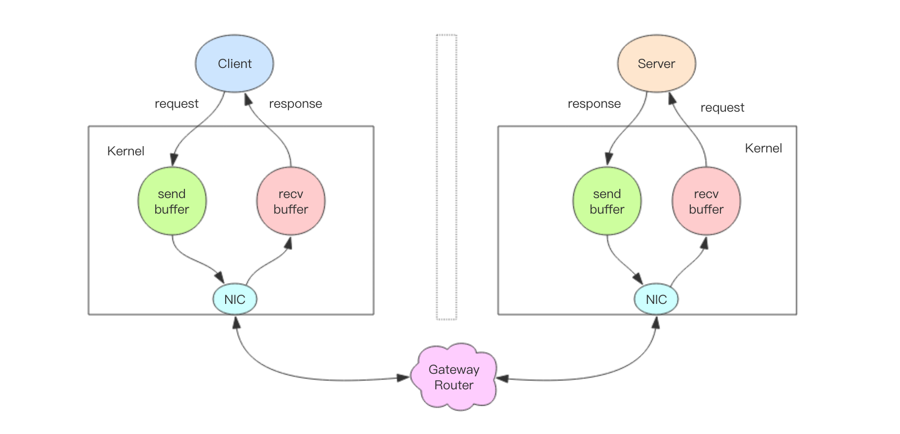

# Pipeline
实际上 Redis 管道 (Pipeline) 本身并不是 Redis 服务器直接提供的技术，这个技术本质上是由客户端提供的，跟服务器没有什么直接的关系。

客户端通过对管道中的指令列表改变读写顺序就可以大幅节省 IO 时间。管道中指令越多，效果越好。

## 管道压力测试
```shell script
Franks-Mac:playRedis frank$ redis-benchmark --help
Usage: redis-benchmark [-h <host>] [-p <port>] [-c <clients>] [-n <requests>] [-k <boolean>]

 -h <hostname>      Server hostname (default 127.0.0.1)
 -p <port>          Server port (default 6379)
 -s <socket>        Server socket (overrides host and port)
 -a <password>      Password for Redis Auth
 -c <clients>       Number of parallel connections (default 50)
 -n <requests>      Total number of requests (default 100000)
 -d <size>          Data size of SET/GET value in bytes (default 3)
 --dbnum <db>       SELECT the specified db number (default 0)
 -k <boolean>       1=keep alive 0=reconnect (default 1)
 -r <keyspacelen>   Use random keys for SET/GET/INCR, random values for SADD
  Using this option the benchmark will expand the string __rand_int__
  inside an argument with a 12 digits number in the specified range
  from 0 to keyspacelen-1. The substitution changes every time a command
  is executed. Default tests use this to hit random keys in the
  specified range.
 -P <numreq>        Pipeline <numreq> requests. Default 1 (no pipeline).
 -e                 If server replies with errors, show them on stdout.
                    (no more than 1 error per second is displayed)
 -q                 Quiet. Just show query/sec values
 --csv              Output in CSV format
 -l                 Loop. Run the tests forever
 -t <tests>         Only run the comma separated list of tests. The test
                    names are the same as the ones produced as output.
 -I                 Idle mode. Just open N idle connections and wait.

Examples:

 Run the benchmark with the default configuration against 127.0.0.1:6379:
   $ redis-benchmark

 Use 20 parallel clients, for a total of 100k requests, against 192.168.1.1:
   $ redis-benchmark -h 192.168.1.1 -p 6379 -n 100000 -c 20

 Fill 127.0.0.1:6379 with about 1 million keys only using the SET test:
   $ redis-benchmark -t set -n 1000000 -r 100000000

 Benchmark 127.0.0.1:6379 for a few commands producing CSV output:
   $ redis-benchmark -t ping,set,get -n 100000 --csv

 Benchmark a specific command line:
   $ redis-benchmark -r 10000 -n 10000 eval 'return redis.call("ping")' 0

 Fill a list with 10000 random elements:
   $ redis-benchmark -r 10000 -n 10000 lpush mylist __rand_int__

 On user specified command lines __rand_int__ is replaced with a random integer
 with a range of values selected by the -r option.

# 我们对一个普通的 set 指令进行压测，QPS 大约 1.2w/s。
Franks-Mac:playRedis frank$ redis-benchmark -p 6679 -t set -q
SET: 12514.08 requests per second

# 不需要密码也可以压力测试
Franks-Mac:playRedis frank$ redis-benchmark -t set -q
SET: 11796.63 requests per second

Franks-Mac:playRedis frank$ redis-cli
127.0.0.1:6379> scan 0 match * count 1000
(error) NOAUTH Authentication required.
127.0.0.1:6379> exit

# 我们加入管道选项-P参数，它表示单个管道内并行的请求数量，看下面P=2，QPS 达到了 2.6w/s。
Franks-Mac:playRedis frank$ redis-benchmark -t set -P 2 -q
SET: 26462.03 requests per second

Franks-Mac:playRedis frank$ redis-benchmark -t set -P 3 -q
SET: 40683.48 requests per second

Franks-Mac:playRedis frank$ redis-benchmark -t set -P 8 -q
SET: 108342.37 requests per second

# 但如果再继续提升 P 参数，发现 QPS 已经上不去了。这是为什么呢？
# 因为这里 CPU 处理能力已经达到了瓶颈，Redis 的单线程 CPU 已经飙到了 100%，所以无法再继续提升了。
Franks-Mac:playRedis frank$ redis-benchmark -t set -P 9 -q
SET: 108459.87 requests per second

```

## 深入理解管道本质

- 客户端进程调用write将消息写到操作系统内核为套接字分配的发送缓冲send buffer。
- 客户端操作系统内核将发送缓冲的内容发送到网卡，网卡硬件将数据通过「网际路由」送到服务器的网卡。
- 服务器操作系统内核将网卡的数据放到内核为套接字分配的接收缓冲recv buffer。
- 服务器进程调用read从接收缓冲中取出消息进行处理。
- 服务器进程调用write将响应消息写到内核为套接字分配的发送缓冲send buffer。
- 服务器操作系统内核将发送缓冲的内容发送到网卡，网卡硬件将数据通过「网际路由」送到客户端的网卡。
- 客户端操作系统内核将网卡的数据放到内核为套接字分配的接收缓冲recv buffer。
- 客户端进程调用read从接收缓冲中取出消息返回给上层业务逻辑进行处理。
- 结束。

我们开始以为 write 操作是要等到对方收到消息才会返回，但实际上不是这样的。write 操作只负责将数据写到本地操作系统内核的发送缓冲然后就返回了。
剩下的事交给操作系统内核异步将数据送到目标机器。但是如果发送缓冲满了，那么就需要等待缓冲空出空闲空间来，这个就是写操作 IO 操作的真正耗时。

我们开始以为 read 操作是从目标机器拉取数据，但实际上不是这样的。read 操作只负责将数据从本地操作系统内核的接收缓冲中取出来就了事了。
但是如果缓冲是空的，那么就需要等待数据到来，这个就是读操作 IO 操作的真正耗时。

所以对于value = redis.get(key)这样一个简单的请求来说，write操作几乎没有耗时，直接写到发送缓冲就返回，而read就会比较耗时了，
因为它要等待消息经过网络路由到目标机器处理后的响应消息,再回送到当前的内核读缓冲才可以返回。这才是一个网络来回的真正开销。

而对于管道来说，连续的write操作根本就没有耗时，之后第一个read操作会等待一个网络的来回开销，然后所有的响应消息就都已经回送到内核的读缓冲了，
后续的 read 操作直接就可以从缓冲拿到结果，瞬间就返回了。

这就是管道的本质了，它并不是服务器的什么特性，而是客户端通过改变了读写的顺序带来的性能的巨大提升。

