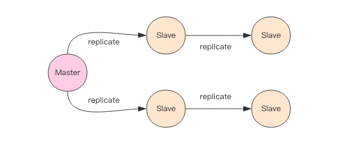

# Replication

## CAP原理
-  C - Consistent ，一致性
-  A - Availability ，可用性
-  P - Partition tolerance ，分区容忍性

分布式系统的节点往往都是分布在不同的机器上进行网络隔离开的，这意味着必然会有网络断开的风险，这个网络断开的场景的专业词汇叫着「网络分区」。

在网络分区发生时，两个分布式节点之间无法进行通信，我们对一个节点进行的修改操作将无法同步到另外一个节点，所以数据的「一致性」将无法满足，
因为两个分布式节点的数据不再保持一致。除非我们牺牲「可用性」，也就是暂停分布式节点服务，在网络分区发生时，不再提供修改数据的功能，
直到网络状况完全恢复正常再继续对外提供服务。

一句话概括 CAP 原理就是——网络分区发生时，一致性和可用性两难全。

## 最终一致
Redis 的主从数据是异步同步的，所以分布式的 Redis 系统并不满足「一致性」要求。当客户端在 Redis 的主节点修改了数据后，立即返回，
即使在主从网络断开的情况下，主节点依旧可以正常对外提供修改服务，所以 Redis 满足「可用性」。

Redis 保证「最终一致性」，从节点会努力追赶主节点，最终从节点的状态会和主节点的状态将保持一致。如果网络断开了，主从节点的数据将会出现大量不一致，
一旦网络恢复，从节点会采用多种策略努力追赶上落后的数据，继续尽力保持和主节点一致。

## 同步
Redis 同步支持主从同步和从从同步，从从同步功能是 Redis 后续版本增加的功能，为了减轻主库的同步负担。



### 增量同步
Redis 同步的是指令流，主节点会将那些对自己的状态产生修改性影响的指令记录在本地的内存 buffer 中，然后异步将 buffer 中的指令同步到从节点，
从节点一边执行同步的指令流来达到和主节点一样的状态，一边向主节点反馈自己同步到哪里了 (偏移量offset)。

因为内存的 buffer 是有限的，所以 Redis 主库不能将所有的指令都记录在内存 buffer 中。Redis 的复制内存 buffer 是一个定长的环形数组，
如果数组内容满了，就会从头开始覆盖前面的内容。


如果因为网络状况不好，从节点在短时间内无法和主节点进行同步，那么当网络状况恢复时，Redis 的主节点中那些没有同步的指令在 buffer 中有可能已经被后续的指令覆盖掉了，
从节点将无法直接通过指令流来进行同步，这个时候就需要用到更加复杂的同步机制 —— 快照同步。

### 快照同步
快照同步是一个非常耗费资源的操作，它首先需要在主库上进行一次 bgsave 将当前内存的数据全部快照到磁盘文件中，然后再将快照文件的内容全部传送到从节点。
从节点将快照文件接受完毕后，立即执行一次全量加载，加载之前先要将当前内存的数据清空。加载完毕后通知主节点继续进行增量同步。
    
    1.主服务器执行bgsave操作,生成rdb文件,将rdb文件发送给从服务器
    2.从服务器接收rdb文件,载入数据到内存中
    3.在发送的过程中,主服务器记录发送过程中所有的写命令到缓冲区中
    4.从服务器载入rdb文件完成后通知主服务器,主服务器将缓冲区中的数据发送给从服务
    5.从服务执行命令将自己的数据库状态更新到主服务器对应的状态
    6.之后主从进行命令传播

在整个快照同步进行的过程中，主节点的复制 buffer 还在不停的往前移动，如果快照同步的时间过长或者复制 buffer 太小，
都会导致同步期间的增量指令在复制 buffer 中被覆盖，这样就会导致快照同步完成后无法进行增量复制，然后会再次发起快照同步，如此极有可能会陷入快照同步的死循环。


所以务必配置一个合适的复制 buffer 大小参数，避免快照复制的死循环。

当从节点刚刚加入到集群时，它必须先要进行一次快照同步，同步完成后再继续进行增量同步。

#### 无盘复制
主节点在进行快照同步时，会进行很重的文件 IO 操作，特别是对于非 SSD 磁盘存储时，快照会对系统的负载产生较大影响。
特别是当系统正在进行 AOF 的 fsync 操作时如果发生快照，fsync 将会被推迟执行，这就会严重影响主节点的服务效率。

所以从 Redis 2.8.18 版开始支持无盘复制。所谓无盘复制是指主服务器直接通过套接字将快照内容发送到从节点，生成快照是一个遍历的过程，
主节点会一边遍历内存，一边将序列化的内容发送到从节点，从节点还是跟之前一样，先将接收到的内容存储到磁盘文件中，再进行一次性加载。

本质上是省去主节点快照持久化到磁盘文件的步骤，节省时间和资源消耗。

## Wait 指令
Redis 的复制是异步进行的，wait 指令可以让异步复制变身同步复制，确保系统的强一致性 (不严格)。wait 指令是 Redis3.0 版本以后才出现的。
    
    > set key value
    OK
    > wait 1 0
    (integer) 1

    wait numreplicas timeout
    
wait 提供两个参数，第一个参数是从库的数量 N，第二个参数是时间 t，以毫秒为单位。
它表示等待 wait 指令之前的所有写操作同步到 N 个从库 (也就是确保 N 个从库的同步没有滞后)，最多等待时间 t。
如果时间 t=0，表示无限等待直到 N 个从库同步完成达成一致。

假设此时出现了网络分区，wait 指令第二个参数时间 t=0，主从同步无法继续进行，wait 指令会永远阻塞，Redis 服务器将丧失可用性。

## 小结
主从复制是 Redis 分布式的基础，Redis 的高可用离开了主从复制将无从进行。

不过复制功能也不是必须的，如果你将 Redis 只用来做缓存，跟 memcache 一样来对待，也就无需要从库做备份，挂掉了重新启动一下就行。
但是只要你使用了 Redis 的持久化功能，就必须认真对待主从复制，它是系统数据安全的基础保障。

## 实验Docker配置主从复制
- 获取本机局域网IP 192.168.0.28
- 起redis服务的docker容器
    
    ```shell script
    docker run \
     -p 6479:6379 \
     -v $PWD/data:/data \
     --name redis2 \
     --restart=always \
     -d redis redis-server --appendonly yes 
    
    docker run \
     -p 6579:6379 \
     -v $PWD/data:/data \
     --name redis3 \
     --restart=always \
     -d redis redis-server --appendonly yes 
    ```

- 进入redis-cli配置主从，以上每一个docker中的redis服务up后默认都是master节点，所以只需要配置slave节点即可
    
    - 都是本地起的docker，使用环路地址不成功
        ```shell script
        127.0.0.1:6479> slaveof 127.0.0.1 6579
        OK
        127.0.0.1:6479> info replication
        # Replication
        role:slave
        master_host:127.0.0.1
        master_port:6579
        master_link_status:down
        master_last_io_seconds_ago:-1
        master_sync_in_progress:0
        slave_repl_offset:0
        master_link_down_since_seconds:1590993979
        slave_priority:100
        slave_read_only:1
        connected_slaves:0
        master_replid:c105693a9a69fe6075d5f6fd373a3540200bb874
        master_replid2:0000000000000000000000000000000000000000
        master_repl_offset:0
        second_repl_offset:-1
        repl_backlog_active:0
        repl_backlog_size:1048576
        repl_backlog_first_byte_offset:0
        repl_backlog_histlen:0
        127.0.0.1:6479> 
        ```
        顺便查看主节点确实没有成功
        ```shell script
        127.0.0.1:6579> info replication
        # Replication
        role:master
        connected_slaves:0
        master_replid:b976d7505f1729fd33d7324bee5d3d6d73c680a6
        master_replid2:0000000000000000000000000000000000000000
        master_repl_offset:0
        second_repl_offset:-1
        repl_backlog_active:0
        repl_backlog_size:1048576
        repl_backlog_first_byte_offset:0
        repl_backlog_histlen:0
        ```
    
    - 使用内网地址则配置成功。
        ```shell script
        127.0.0.1:6479> slaveof 192.168.0.28 6579
        OK
        127.0.0.1:6479> info replication
        # Replication
        role:slave
        master_host:192.168.0.28
        master_port:6579
        master_link_status:up
        master_last_io_seconds_ago:6
        master_sync_in_progress:0
        slave_repl_offset:28
        slave_priority:100
        slave_read_only:1
        connected_slaves:0
        master_replid:2ae819f60aff40efae137e8d049c3fdbe763dccc
        master_replid2:0000000000000000000000000000000000000000
        master_repl_offset:28
        second_repl_offset:-1
        repl_backlog_active:1
        repl_backlog_size:1048576
        repl_backlog_first_byte_offset:1
        repl_backlog_histlen:28
        ```
        顺便查看下主节点的info，可知slave有一个了。
        ```shell script
        127.0.0.1:6579> info replication
        # Replication
        role:master
        connected_slaves:1
        slave0:ip=172.17.0.1,port=6379,state=online,offset=0,lag=0
        master_replid:2ae819f60aff40efae137e8d049c3fdbe763dccc
        master_replid2:0000000000000000000000000000000000000000
        master_repl_offset:0
        second_repl_offset:-1
        repl_backlog_active:1
        repl_backlog_size:1048576
        repl_backlog_first_byte_offset:1
        repl_backlog_histlen:0
        127.0.0.1:6579> 
        ```
- 测试
    ```shell script
    # master
    127.0.0.1:6579> set hello world
    OK
    127.0.0.1:6579> wait 1 0
    (integer) 1
    
    # slave
    127.0.0.1:6479> get hello
    "world"
    ```
- 可能用到的指令
    ```shell script
    # 查看redis服务器信息
    info [section]
    
    # 这两个指令等价，redis5.0后推荐用replicaof
    slaveof host port
    replicaof host port
    
    # 在主节点设置访问密码，或者取消密码
    config set requirepass 123654
    config set requirepass ""
    
    # 在从节点设置同步主节点需要的密码，或者取消密码
    config set masterauth 123654
    config set masterauth ""
    ```
- 也可以使用修改redis.conf配置文件，并映射到容器中的方式起docker，然后在容器中指定配置文件启动redis-server服务。
    ```shell script
    # master.conf
    # bind 127.0.0.1 # 注释当前行，表示任意ip可连
    daemonize yes # 让redis服务后台运行
    requirepass masterpassword # 设定密码
    
    # slave.conf
    # bind 127.0.0.1
    daemonize yes
    requirepass slavepassword # 从库密码，可选配置
    # <masterip>表示主库所在的ip，而<masterport>则表示主库启动的端口，默认是6379
    slaveof <masterip> <masterport>
    # 主库有密码必需要配置，<master-password>代表主库的访问密码
    masterauth <master-password>
    
    # 运行master服务
    docker run -it --name redis-master -v /root/redis/redis-master.conf:/usr/local/etc/redis/redis.conf -d -p 6300:6379 redis /bin/bash
    # 进入容器
    docker exec -it redis-master bash
    # 加载配置
    redis-server /usr/local/etc/redis/redis.conf
    
    # 运行slave服务
    docker run -it --name redis-slave -v /root/redis/redis-slave.conf:/usr/local/etc/redis/redis.conf -d -p 6301:6379 redis /bin/bash
    # 进入容器
    docker exec -it redis-slave bash
    # 加载配置
    redis-server /usr/local/etc/redis/redis.conf
    # 测试连接
    redis-cli
    # 密码认证
    auth <slave-password>
    
    ```