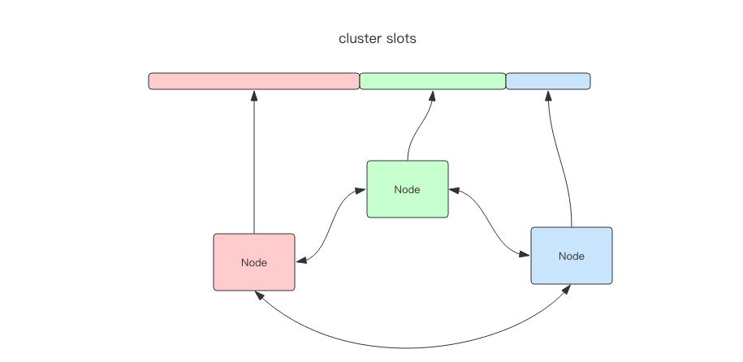

# Sentinel
Sentinel 哨兵

我们必须有一个高可用方案来抵抗节点故障，当故障发生时可以自动进行从主切换，程序可以不用重启，运维可以继续睡大觉，
仿佛什么事也没发生一样。Redis 官方提供了这样一种方案 —— Redis Sentinel(哨兵)。


Codis是Redis集群方案之一，使用Golang开发，它是一个代理中间件


RedisCluster是redis官方集群方案，相对于 Codis 的不同，它是去中心化的，如图所示，该集群有三个 Redis 节点组成，每个节点负责整个集群的一部分数据，
每个节点负责的数据多少可能不一样。这三个节点相互连接组成一个对等的集群，它们之间通过一种特殊的Gossip二进制协议相互交互集群信息。


sentinel用于redis的高可用

codis和redis-cluster用于redis的高性能

Redis5.0 最大的新特性就是多出了一个数据结构 Stream，它是一个新的强大的支持多播的可持久化的消息队列


```shell script
127.0.0.1:6579> xadd codehole * name laoqian age 30
"1600936632773-0"
127.0.0.1:6579> xadd codehole * name xiaoyu age 27
"1600936673592-0"
127.0.0.1:6579> xadd codehole * name xiaoqiang age 1
"1600936694796-0"
127.0.0.1:6579> xlen codehole
(integer) 3
127.0.0.1:6579> xrange codehole - +
1) 1) "1600936632773-0"
   2) 1) "name"
      2) "laoqian"
      3) "age"
      4) "30"
2) 1) "1600936673592-0"
   2) 1) "name"
      2) "xiaoyu"
      3) "age"
      4) "27"
3) 1) "1600936694796-0"
   2) 1) "name"
      2) "xiaoqiang"
      3) "age"
      4) "1"
127.0.0.1:6579> xrange codehole 1600936694796-0 +
1) 1) "1600936694796-0"
   2) 1) "name"
      2) "xiaoqiang"
      3) "age"
      4) "1"
127.0.0.1:6579> xrange codehole - 1600936694796-0
1) 1) "1600936632773-0"
   2) 1) "name"
      2) "laoqian"
      3) "age"
      4) "30"
2) 1) "1600936673592-0"
   2) 1) "name"
      2) "xiaoyu"
      3) "age"
      4) "27"
3) 1) "1600936694796-0"
   2) 1) "name"
      2) "xiaoqiang"
      3) "age"
      4) "1"
127.0.0.1:6579> xdel codehole 1600936694796-0
(integer) 1
127.0.0.1:6579> xlen codehole
(integer) 2
127.0.0.1:6579> xrange codehole - +
1) 1) "1600936632773-0"
   2) 1) "name"
      2) "laoqian"
      3) "age"
      4) "30"
2) 1) "1600936673592-0"
   2) 1) "name"
      2) "xiaoyu"
      3) "age"
      4) "27"
127.0.0.1:6579> xread count 2 streams codehole 0-0
1) 1) "codehole"
   2) 1) 1) "1600936632773-0"
         2) 1) "name"
            2) "laoqian"
            3) "age"
            4) "30"
      2) 1) "1600936673592-0"
         2) 1) "name"
            2) "xiaoyu"
            3) "age"
            4) "27"
127.0.0.1:6579> xread count 1 streams codehole 0-0
1) 1) "codehole"
   2) 1) 1) "1600936632773-0"
         2) 1) "name"
            2) "laoqian"
            3) "age"
            4) "30"
127.0.0.1:6579> 
127.0.0.1:6579> xread count 1 streams codehole $
(nil)
127.0.0.1:6579> xread count 1 block 0 streams codehole $
1) 1) "codehole"
   2) 1) 1) "1600937562586-0"
         2) 1) "name"
            2) "yaoming"
            3) "age"
            4) "40"
(43.66s)
127.0.0.1:6579> 
127.0.0.1:6579> xread count 1 block 0 streams codehole $
1) 1) "codehole"
   2) 1) 1) "1600938561369-0"
         2) 1) "name"
            2) "yaoming"
            3) "age"
            4) "40"
(9.32s)
127.0.0.1:6579> xread count 1 block 0 streams codehole $
1) 1) "codehole"
   2) 1) 1) "1600938575786-0"
         2) 1) "name"
            2) "yaoming"
            3) "age"
            4) "40"
(2.48s)
127.0.0.1:6579> xgroup create codehole cg1 0-1
OK
127.0.0.1:6579> xgroup create codehole cg2 $
OK
127.0.0.1:6579> xinfo stream codehole
 1) "length"
 2) (integer) 5
 3) "radix-tree-keys"
 4) (integer) 1
 5) "radix-tree-nodes"
 6) (integer) 2
 7) "groups"
 8) (integer) 2
 9) "last-generated-id"
10) "1600938575786-0"
11) "first-entry"
12) 1) "1600936632773-0"
    2) 1) "name"
       2) "laoqian"
       3) "age"
       4) "30"
13) "last-entry"
14) 1) "1600938575786-0"
    2) 1) "name"
       2) "yaoming"
       3) "age"
       4) "40"
127.0.0.1:6579> 
127.0.0.1:6579> xinfo groups codehole
1) 1) "name"
   2) "cg1"
   3) "consumers"
   4) (integer) 0
   5) "pending"
   6) (integer) 0
   7) "last-delivered-id"
   8) "0-1"
2) 1) "name"
   2) "cg2"
   3) "consumers"
   4) (integer) 0
   5) "pending"
   6) (integer) 0
   7) "last-delivered-id"
   8) "1600938575786-0"
127.0.0.1:6579> 
127.0.0.1:6579> xreadgroup GROUP cg1 c1 COUNT 1 streams codehole >
1) 1) "codehole"
   2) 1) 1) "1600936632773-0"
         2) 1) "name"
            2) "laoqian"
            3) "age"
            4) "30"
127.0.0.1:6579> xreadgroup GROUP cg1 c1 COUNT 1 streams codehole >
1) 1) "codehole"
   2) 1) 1) "1600936673592-0"
         2) 1) "name"
            2) "xiaoyu"
            3) "age"
            4) "27"
127.0.0.1:6579> xreadgroup GROUP cg1 c1 COUNT 1 streams codehole >
1) 1) "codehole"
   2) 1) 1) "1600937562586-0"
         2) 1) "name"
            2) "yaoming"
            3) "age"
            4) "40"
127.0.0.1:6579> xreadgroup GROUP cg1 c1 COUNT 1 streams codehole >
1) 1) "codehole"
   2) 1) 1) "1600938561369-0"
         2) 1) "name"
            2) "yaoming"
            3) "age"
            4) "40"
127.0.0.1:6579> xreadgroup GROUP cg1 c1 COUNT 1 streams codehole >
1) 1) "codehole"
   2) 1) 1) "1600938575786-0"
         2) 1) "name"
            2) "yaoming"
            3) "age"
            4) "40"
127.0.0.1:6579> xreadgroup GROUP cg1 c1 COUNT 1 streams codehole >
(nil)
127.0.0.1:6579> xreadgroup group cg1 c1 COUNT 1 block 0 streams codehole >
1) 1) "codehole"
   2) 1) 1) "1600939318225-0"
         2) 1) "name"
            2) "laoying"
            3) "age"
            4) "2"
(22.89s)
127.0.0.1:6579> xinfo groups codehole
1) 1) "name"
   2) "cg1"
   3) "consumers"
   4) (integer) 1
   5) "pending"
   6) (integer) 6
   7) "last-delivered-id"
   8) "1600939318225-0"
2) 1) "name"
   2) "cg2"
   3) "consumers"
   4) (integer) 0
   5) "pending"
   6) (integer) 0
   7) "last-delivered-id"
   8) "1600938575786-0"
127.0.0.1:6579> 
127.0.0.1:6579> xinfo consumers codehole cg1
1) 1) "name"
   2) "c1"
   3) "pending"
   4) (integer) 6
   5) "idle"
   6) (integer) 163655
127.0.0.1:6579> 
127.0.0.1:6579> 
127.0.0.1:6579> xack codehole cg1 1600939318225-0
(integer) 1
127.0.0.1:6579> xinfo consumers codehole cg1
1) 1) "name"
   2) "c1"
   3) "pending"
   4) (integer) 5
   5) "idle"
   6) (integer) 353693
127.0.0.1:6579> xinfo groups codehole
1) 1) "name"
   2) "cg1"
   3) "consumers"
   4) (integer) 1
   5) "pending"
   6) (integer) 5
   7) "last-delivered-id"
   8) "1600939318225-0"
2) 1) "name"
   2) "cg2"
   3) "consumers"
   4) (integer) 0
   5) "pending"
   6) (integer) 0
   7) "last-delivered-id"
   8) "1600938575786-0"
127.0.0.1:6579> 
127.0.0.1:6579> xrange codehole - +
1) 1) "1600936632773-0"
   2) 1) "name"
      2) "laoqian"
      3) "age"
      4) "30"
2) 1) "1600936673592-0"
   2) 1) "name"
      2) "xiaoyu"
      3) "age"
      4) "27"
3) 1) "1600937562586-0"
   2) 1) "name"
      2) "yaoming"
      3) "age"
      4) "40"
4) 1) "1600938561369-0"
   2) 1) "name"
      2) "yaoming"
      3) "age"
      4) "40"
5) 1) "1600938575786-0"
   2) 1) "name"
      2) "yaoming"
      3) "age"
      4) "40"
6) 1) "1600939318225-0"
   2) 1) "name"
      2) "laoying"
      3) "age"
      4) "2"
127.0.0.1:6579> xack codehole cg1 1600938575786-0 1600938561369-0 1600937562586-0
(integer) 3
127.0.0.1:6579> xinfo group cg1
(error) ERR no such key
127.0.0.1:6579> xinfo groups cg1
(error) ERR no such key
127.0.0.1:6579> 
127.0.0.1:6579> xinfo groups codehole
1) 1) "name"
   2) "cg1"
   3) "consumers"
   4) (integer) 1
   5) "pending"
   6) (integer) 2
   7) "last-delivered-id"
   8) "1600939318225-0"
2) 1) "name"
   2) "cg2"
   3) "consumers"
   4) (integer) 0
   5) "pending"
   6) (integer) 0
   7) "last-delivered-id"
   8) "1600938575786-0"
127.0.0.1:6579> xinfo consumers codehole cg1
1) 1) "name"
   2) "c1"
   3) "pending"
   4) (integer) 2
   5) "idle"
   6) (integer) 529916
127.0.0.1:6579> 
127.0.0.1:6579> xlen codehole
(integer) 6
127.0.0.1:6579> xadd codehole maxlen 3 * name xiaorui age 21
"1600939931072-0"
127.0.0.1:6579> 
127.0.0.1:6579> xlen codehole
(integer) 3
127.0.0.1:6579> 
127.0.0.1:6579> 
127.0.0.1:6579> xrange codehole - +
1) 1) "1600938575786-0"
   2) 1) "name"
      2) "yaoming"
      3) "age"
      4) "40"
2) 1) "1600939318225-0"
   2) 1) "name"
      2) "laoying"
      3) "age"
      4) "2"
3) 1) "1600939931072-0"
   2) 1) "name"
      2) "xiaorui"
      3) "age"
      4) "21"
127.0.0.1:6579> xdel codehole 1600938575786-0
(integer) 1
127.0.0.1:6579> xrange codehole - +
1) 1) "1600939318225-0"
   2) 1) "name"
      2) "laoying"
      3) "age"
      4) "2"
2) 1) "1600939931072-0"
   2) 1) "name"
      2) "xiaorui"
      3) "age"
      4) "21"
127.0.0.1:6579> xlen codehole
(integer) 2
127.0.0.1:6579> 
```
Stream 的消费模型借鉴了 Kafka 的消费分组的概念，它弥补了 Redis Pub/Sub 不能持久化消息的缺陷。
但是它又不同于 kafka，Kafka 的消息可以分 partition，而 Stream 不行。
如果非要分 parition 的话，得在客户端做，提供不同的 Stream 名称，对消息进行 hash 取模来选择往哪个 Stream 里塞。

reference [stream](https://juejin.im/book/6844733724618129422/section/6844733724727181325)

todo 搭建一套 redis-sentinel 集群

容器启动的redis服务最后有一个命令redis-server，那么这个容器中是否有sentinel执行文件呢？

```shell script
Franks-Mac:~ frank$ docker exec -it 4046247e947c bash
root@4046247e947c:/data# which redis-server
/usr/local/bin/redis-server
root@4046247e947c:/data# cd /usr/local/bin/
root@4046247e947c:/usr/local/bin# ls
docker-entrypoint.sh  redis-benchmark  redis-check-rdb	redis-sentinel
gosu		      redis-check-aof  redis-cli	redis-server

```

todo 搭建一套 redis cluster


