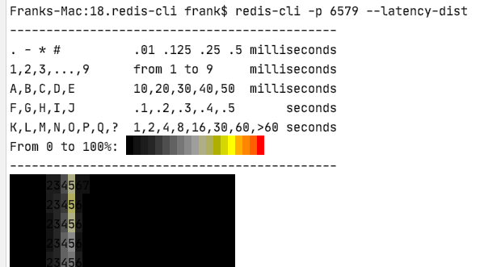

# Redis-cli
## run command
```shell script
$ redis-cli incrby foo 5
$ redis-cli -p 6579 info > info.txt
```
## file content command
管道重定向，标准输出重定向作为redis-cli 命令
```shell script
Franks-Mac:18.redis-cli frank$ cat cmds.txt 
set hello1 world1
set hello2 world2
set hello3 world3
Franks-Mac:18.redis-cli frank$ cat cmds.txt | redis-cli -p 6579
OK
OK
OK
Franks-Mac:18.redis-cli frank$ redis-cli -p 6579 get hello1
"world1"
```
## file content arg
文件作为redis-cli命令的参数， -x
```
Franks-Mac:18.redis-cli frank$ cat multi-line.txt 
hello i'm nala
2019 awards
qiongha
Franks-Mac:18.redis-cli frank$ redis-cli -p 6579 -x set nala < multi-line.txt 
OK
Franks-Mac:18.redis-cli frank$ redis-cli -p 6579 get nala
"hello i'm nala\n2019 awards\nqiongha\n"
```
## repeat command
观察qps的变化
```shell script
# -r 5 重复5次， -i 1 间隔1s 
$ redis-cli -p 6579 -r 5 -i 1 info |grep ops
instantaneous_ops_per_sec:0
instantaneous_ops_per_sec:0
instantaneous_ops_per_sec:0
instantaneous_ops_per_sec:0
instantaneous_ops_per_sec:0
```
## state
```shell script
$ redis-cli -p 6579 --stat
------- data ------ --------------------- load -------------------- - child -
keys       mem      clients blocked requests            connections          
15         859.30K  2       0       110 (+0)            31          
15         859.30K  2       0       111 (+1)            31          
15         859.30K  2       0       112 (+1)            31          
15         859.30K  2       0       113 (+1)            31          
15         859.30K  2       0       114 (+1)            31          
15         859.30K  2       0       115 (+1)            31          
15         859.30K  2       0       116 (+1)            31          
15         859.30K  2       0       117 (+1)            31          
15         859.30K  2       0       118 (+1)            31     
```

## big key
```shell script
$ redis-cli -p 6579 --bigkeys -i 0.01

# Scanning the entire keyspace to find biggest keys as well as
# average sizes per key type.  You can use -i 0.1 to sleep 0.1 sec
# per 100 SCAN commands (not usually needed).

[00.00%] Biggest string found so far 'value11' with 7 bytes
[00.00%] Biggest stream found so far 'codehole' with 2 entries
[00.00%] Biggest list   found so far 'lfoo' with 6 items
[00.00%] Biggest string found so far 'foo' with 112 bytes
[66.67%] Biggest hash   found so far 'fooo' with 2 fields

-------- summary -------

Sampled 15 keys in the keyspace!
Total key length in bytes is 80 (avg len 5.33)

Biggest   list found 'lfoo' has 6 items
Biggest   hash found 'fooo' has 2 fields
Biggest string found 'foo' has 112 bytes
Biggest stream found 'codehole' has 2 entries

1 lists with 6 items (06.67% of keys, avg size 6.00)
1 hashs with 2 fields (06.67% of keys, avg size 2.00)
12 strings with 198 bytes (80.00% of keys, avg size 16.50)
1 streams with 2 entries (06.67% of keys, avg size 2.00)
0 sets with 0 members (00.00% of keys, avg size 0.00)
0 zsets with 0 members (00.00% of keys, avg size 0.00)

```
它能保证输出长度为 Top1 的 KEY，但是 Top2、Top3等 KEY 是无法保证可以扫描出来的。
一般的处理方法是多扫描几次，或者是消灭了 Top1 的 KEY 之后再扫描确认还有没有次大的 KEY。

## monitor
现在线上有一台 Redis 服务器的 OPS 太高，有很多业务模块都在使用这个 Redis，如何才能判断出来是哪个业务导致了 OPS 异常的高。
这时可以对线上服务器的指令进行采样，观察采样的指令大致就可以分析出 OPS 占比高的业务点。这时就要使用 monitor 指令，它会将服务器瞬间执行的指令全部显示出来。
```
# redis-cli -h xxx.redis.xxx.aliyuncs.com -p 6379 monitor
OK
1605064531.506611 [0 172.19.176.215:60554] "KEYS" "CheckTransaction:*"
1605064531.605210 [1 172.19.176.215:53868] "PING"
1605064531.605374 [1 172.19.176.215:53868] "BLPOP" "dq_queue_requestStopTransaction" "17"
1605064531.812463 [1 172.19.176.215:53872] "PING"
1605064531.812491 [1 172.19.176.215:53866] "PING"
1605064531.812657 [1 172.19.176.215:53872] "ZRANGE" "dq_bucket_1" "0" "0" "WITHSCORES"
1605064531.812683 [1 172.19.176.215:53866] "ZRANGE" "dq_bucket_2" "0" "0" "WITHSCORES"
1605064532.093634 [0 127.0.0.1:48090] "info" "all"
1605064532.607079 [1 172.19.176.215:53854] "PING"
1605064532.607258 [1 172.19.176.215:53854] "BLPOP" "dq_queue_requestStartTransaction" "17"
1605064532.706779 [1 172.19.176.215:53852] "PING"
1605064532.706930 [1 172.19.176.215:53852] "BLPOP" "dq_queue_requestStopTransaction" "17"
1605064532.812437 [1 172.19.176.215:53866] "PING"
1605064532.812462 [1 172.19.176.215:53872] "PING"
1605064532.812616 [1 172.19.176.215:53866] "ZRANGE" "dq_bucket_1" "0" "0" "WITHSCORES"
1605064532.812634 [1 172.19.176.215:53872] "ZRANGE" "dq_bucket_2" "0" "0" "WITHSCORES"
1605064533.093922 [0 127.0.0.1:48090] "info" "all"
1605064533.336589 [0 172.19.176.215:60554] "KEYS" "log.chargerStatusChange:*"
1605064533.336879 [0 172.19.176.215:60554] "KEYS" "log.charger:*"
1605064533.507047 [0 172.19.176.215:60554] "KEYS" "CheckTransaction:*"
1605064533.709107 [1 172.19.176.215:53846] "PING"
1605064533.709119 [1 172.19.176.215:53864] "PING"
1605064533.709298 [1 172.19.176.215:53864] "BLPOP" "dq_queue_requestStartTransaction" "17"
1605064533.709319 [1 172.19.176.215:53846] "BLPOP" "dq_queue_requestStopTransaction" "17"
1605064533.812454 [1 172.19.176.215:53866] "PING"
1605064533.812487 [1 172.19.176.215:53872] "PING"
1605064533.812650 [1 172.19.176.215:53866] "ZRANGE" "dq_bucket_1" "0" "0" "WITHSCORES"
1605064533.812679 [1 172.19.176.215:53872] "ZRANGE" "dq_bucket_2" "0" "0" "WITHSCORES"
1605064534.093664 [0 127.0.0.1:48090] "info" "all"
1605064534.812448 [1 172.19.176.215:53872] "PING"
1605064534.812477 [1 172.19.176.215:53866] "PING"
1605064534.812652 [1 172.19.176.215:53872] "ZRANGE" "dq_bucket_1" "0" "0" "WITHSCORES"
1605064534.812678 [1 172.19.176.215:53866] "ZRANGE" "dq_bucket_2" "0" "0" "WITHSCORES"
1605064535.093590 [0 127.0.0.1:48090] "info" "all"
1605064535.507505 [0 172.19.176.215:60554] "KEYS" "CheckTransaction:*"
1605064535.812443 [1 172.19.176.215:53866] "PING"
1605064535.812476 [1 172.19.176.215:53872] "PING"
1605064535.812644 [1 172.19.176.215:53866] "ZRANGE" "dq_bucket_1" "0" "0" "WITHSCORES"
1605064535.812672 [1 172.19.176.215:53872] "ZRANGE" "dq_bucket_2" "0" "0" "WITHSCORES"
1605064536.093605 [0 127.0.0.1:48090] "info" "all"
1605064536.721757 [0 172.19.176.215:60824] "INFO"
1605064536.812435 [1 172.19.176.215:53872] "PING"
1605064536.812587 [1 172.19.176.215:53866] "PING"
1605064536.812744 [1 172.19.176.215:53872] "ZRANGE" "dq_bucket_1" "0" "0" "WITHSCORES"
1605064536.812807 [1 172.19.176.215:53866] "ZRANGE" "dq_bucket_2" "0" "0" "WITHSCORES"
1605064536.912522 [1 172.19.176.215:53840] "PING"
1605064536.912674 [1 172.19.176.215:53840] "BLPOP" "dq_queue_requestStopTransaction" "17"
1605064537.094262 [0 127.0.0.1:48090] "info" "all"
1605064537.507962 [0 172.19.176.215:60554] "KEYS" "CheckTransaction:*"
1605064537.812444 [1 172.19.176.215:53866] "PING"
1605064537.812493 [1 172.19.176.215:53872] "PING"
1605064537.812655 [1 172.19.176.215:53866] "ZRANGE" "dq_bucket_1" "0" "0" "WITHSCORES"
1605064537.812676 [1 172.19.176.215:53872] "ZRANGE" "dq_bucket_2" "0" "0" "WITHSCORES"
1605064538.014853 [1 172.19.176.215:53842] "PING"
1605064538.015004 [1 172.19.176.215:53842] "BLPOP" "dq_queue_requestStopTransaction" "17"
1605064538.093630 [0 127.0.0.1:48090] "info" "all"
1605064538.337264 [0 172.19.176.215:60554] "KEYS" "log.chargerStatusChange:*"
1605064538.337599 [0 172.19.176.215:60554] "KEYS" "log.charger:*"
^C
```
## ping
Redis 也提供了时延诊断指令，不过它的原理不太一样，它是诊断当前机器和 Redis 服务器之间的指令(PING指令)时延，
它不仅仅是物理网络的时延，还和当前的 Redis 主线程是否忙碌有关。
如果你发现 Unix 的 ping 指令时延很小，而 Redis 的时延很大，那说明 Redis 服务器在执行指令时有微弱卡顿。
```shell script
$ redis-cli -p 6579 --latency
min: 1, max: 7, avg: 2.29 (569 samples)^C
```
时延单位是ms。 redis-cli --latency-dist以图形化方式输出

如上图显示时延在4～5millisecond

## remote backup
```shell script
$ ./redis-cli --host 192.168.x.x --port 6379 --rdb ./user.rdb
SYNC sent to master, writing 2501265095 bytes to './user.rdb'
Transfer finished with success.
```
执行下面的命令就可以将远程的 Redis 实例备份到本地机器，远程服务器会执行一次bgsave操作，然后将 rdb 文件传输到客户端。

## simulate
如果你想观察主从服务器之间都同步了那些数据，可以使用 redis-cli 模拟从库。
```shell script
$ ./redis-cli --host 192.168.x.x --port 6379 --slave
SYNC with master, discarding 51778306 bytes of bulk transfer...
SYNC done. Logging commands from master.
```
从库连上主库的第一件事是全量同步，所以看到上面的指令卡顿这很正常，待首次全量同步完成后，就会输出增量的 aof 日志。
