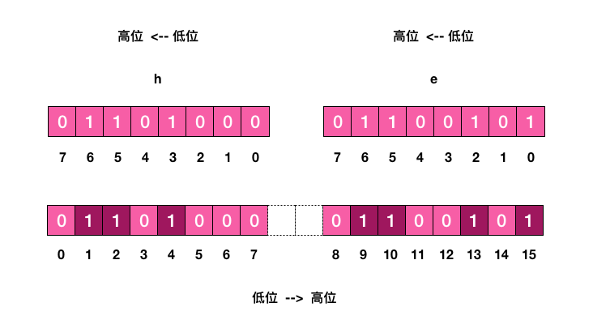

# Bite Map
在我们平时开发过程中，会有一些 bool 型数据需要存取，比如用户一年的签到记录，签了是 1，没签是 0，要记录 365 天。
如果使用普通的 key/value，每个用户要记录 365 个，当用户上亿的时候，需要的存储空间是惊人的。

为了解决这个问题，Redis 提供了位图数据结构，这样每天的签到记录只占据一个位，365 天就是 365 个位，
46 个字节 (一个稍长一点的字符串) 就可以完全容纳下，这就大大节约了存储空间。

位图不是特殊的数据结构，它的内容其实就是普通的字符串，也就是 byte 数组。我们可以使用普通的 get/set 直接获取和设置整个位图的内容，
也可以使用位图操作 getbit/setbit 等将 byte 数组看成「位数组」来处理。

## 基本使用
```shell script
PyDev console: starting.
Python 2.7.16 (default, Feb 29 2020, 01:55:37) 
ord('h')
104
ord('a')
97
bin(104)
'0b1101000'
bin(ord('e'))
'0b1100101'
bin(ord('l'))
'0b1101100'
bin(ord('o'))
'0b1101111'

```
位数组的顺序和字符的位顺序是相反的。
````
h
01101000
76543210
01234567

e
0   1   1   0   0   1   0   1
7   6   5   4   3   2   1   0
8   9   10  11  12  13  14  15
````

setbit key offset value

```shell script
127.0.0.1:6379> setbit s 1 1
(integer) 0
127.0.0.1:6379> setbit s 2 1
(integer) 0
127.0.0.1:6379> setbit s 4 1
(integer) 0
127.0.0.1:6379> get s
"h"
127.0.0.1:6379> setbit s 9 1
(integer) 0
127.0.0.1:6379> setbit s 10  1
(integer) 0
127.0.0.1:6379> setbit s 13 1
(integer) 0
127.0.0.1:6379> setbit s 15 1
(integer) 0
127.0.0.1:6379> get s
"he"
127.0.0.1:6379> 
```
上面这个例子可以理解为「零存整取」，同样我们还也可以「零存零取」，「整存零取」。
「零存」就是使用 setbit 对位值进行逐个设置，
「整存」就是使用字符串一次性填充所有位数组，覆盖掉旧值。

如果对应位的字节是不可打印字符，redis-cli 会显示该字符的 16 进制形式。
```shell script
127.0.0.1:6379> setbit x 0 1 
(integer) 0
127.0.0.1:6379> setbit x 1 1
(integer) 0
127.0.0.1:6379> get x
"\xc0"
```

## 统计和查找
Redis 提供了位图统计指令 bitcount 和位图查找指令 bitpos，
- bitcount 用来统计指定位置范围内 1 的个数，

    通过 bitcount 统计用户一共签到了多少天

- bitpos 用来查找指定范围内出现的第一个 0 或 1。

    通过 bitpos 指令查找用户从哪一天开始第一次签到。

如果指定了范围参数[start, end]，就可以统计在某个时间范围内用户签到了多少天，用户自某天以后的哪天开始签到。

遗憾的是， start 和 end 参数是字节索引，也就是说指定的位范围必须是 8 的倍数，而不能任意指定。
 
```` 
bitcount key [start end]
bitpos key bit [start] [end]
````

```shell script
127.0.0.1:6379> set w hello
OK
127.0.0.1:6379> bitcount w 0 10
(integer) 21
127.0.0.1:6379> bitcount w 0 4
(integer) 21
127.0.0.1:6379> bitcount w 0 3
(integer) 15
127.0.0.1:6379> bitpos w 1
(integer) 1
127.0.0.1:6379> bitpos w 0
(integer) 0
127.0.0.1:6379> bitpos w 0 1 1
(integer) 8
127.0.0.1:6379> bitpos w 1 1 1
(integer) 9
127.0.0.1:6379> 
```

## bitfield
Redis 的 3.2 版本以后新增了一个功能强大的指令，有了这条指令，不用管道也可以一次进行多个位的操作。

bitfield 有三个子指令，分别是 get/set/incrby，它们都可以对指定位片段进行读写，但是最多只能处理 64 个连续的位，
如果超过 64 位，就得使用多个子指令，bitfield 可以一次执行多个子指令。

    bitfield key [GET type offset] [SET type offset value] [INCRBY type offset increment] [OVERFLOW WRAP|SAT|FAIL]


```shell script
127.0.0.1:6379> set w hello
OK
127.0.0.1:6379> bitfield w get u4 0  # 从第一个位开始取 4 个位，结果是无符号数 (u)
1) (integer) 6
127.0.0.1:6379> bitfield w get u3 2  # 从第三个位开始取 3 个位，结果是无符号数 (u)
1) (integer) 5
127.0.0.1:6379> bitfield w get i4 0  # 从第一个位开始取 4 个位，结果是有符号数 (i)
1) (integer) 6
127.0.0.1:6379> bitfield w get i3 2  # 从第三个位开始取 3 个位，结果是有符号数 (i)
1) (integer) -3

```
- 无符号数表示非负数，没有符号位，获取的位数组全部都是值。无符号数只能获取 63 位 (因为 Redis 协议中的 integer 是有符号数，最大 64 位，不能传递 64 位无符号值)
- 有符号数是指获取的位数组中第一个位是符号位，剩下的才是值。如果第一位是 1，那就是负数。有符号数最多可以获取 64 位

解释为啥最后一个是 -3：
````
101 是补码 正数的补码就是其原码；负数的反码+1就是补码
100 是反码 正数的反码就是其原码；负数的反码是将原码中，除符号位以外，每一位取反。
111 是原码 -3
````

将第二个字符 e 改成 a，a 的 ASCII 码是 97
````
127.0.0.1:6379> bitfield w set u8 8 97
1) (integer) 101
127.0.0.1:6379> get w
"hallo"
````

再看第三个子指令 incrby，它用来对指定范围的位进行自增操作。既然提到自增，就有可能出现溢出。
如果增加了正数，会出现上溢，如果增加的是负数，就会出现下溢出。Redis 默认的处理是折返。
如果出现了溢出，就将溢出的符号位丢掉。如果是 8 位无符号数 255，加 1 后就会溢出，会全部变零。
如果是 8 位有符号数 127，加 1 后就会溢出变成 -128。

```shell script
127.0.0.1:6379> set w hello
OK
127.0.0.1:6379> bitfield w incrby u2 1 1
1) (integer) 0
127.0.0.1:6379> bitfield w incrby u2 1 1
1) (integer) 1
127.0.0.1:6379> bitfield w incrby u2 1 1
1) (integer) 2
127.0.0.1:6379> bitfield w incrby u2 1 1
1) (integer) 3
127.0.0.1:6379> bitfield w incrby u2 1 1
1) (integer) 0
127.0.0.1:6379> set w hello
OK
127.0.0.1:6379> bitfield w incrby i2 1 1
1) (integer) 0
127.0.0.1:6379> bitfield w incrby i2 1 1
1) (integer) 1
127.0.0.1:6379> bitfield w incrby i2 1 1
1) (integer) -2
127.0.0.1:6379> bitfield w incrby i2 1 1
1) (integer) -1
127.0.0.1:6379> bitfield w incrby i2 1 1
1) (integer) 0

```

bitfield 指令提供了溢出策略子指令 overflow，用户可以选择溢出行为，
默认是折返 (wrap)，还可以选择失败 (fail) 报错不执行，以及饱和截断 (sat)，超过了范围就停留在最大最小值。
overflow 指令只影响接下来的第一条指令，这条指令执行完后溢出策略会变成默认值折返 (wrap)。

```shell script
127.0.0.1:6379> set w hello
OK
127.0.0.1:6379> bitfield w overflow sat incrby u2 1 1
1) (integer) 3
127.0.0.1:6379> bitfield w overflow sat incrby u2 1 1
1) (integer) 3
127.0.0.1:6379> 
127.0.0.1:6379> bitfield w overflow fail incrby u2 1 1
1) (nil)
127.0.0.1:6379> bitfield w overflow fail incrby u2 1 1
1) (nil)
127.0.0.1:6379> 

```

