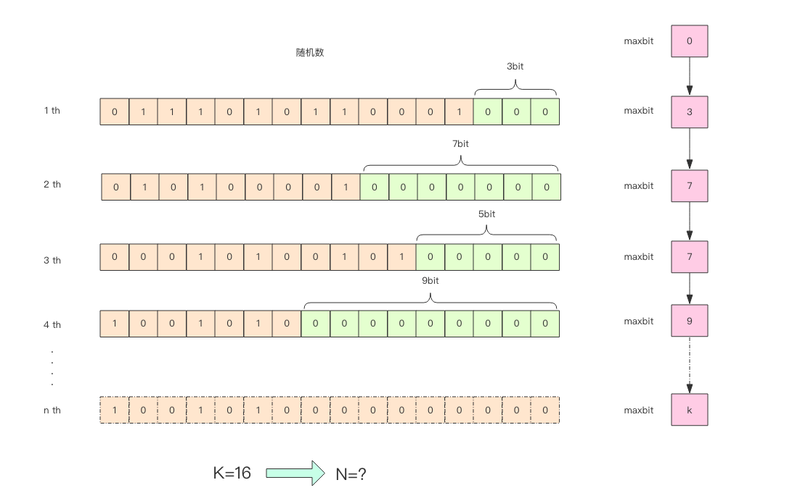

# HyperLogLog

##  PV 和 UV 统计问题
- PV（Page View 页面被打开数）
- UV（User View 浏览页面的用户数）

如果统计 PV 那非常好办，给每个网页一个独立的 Redis 计数器就可以了，这个计数器的 key 后缀加上当天的日期。
这样来一个请求，incrby 一次，最终就可以统计出所有的 PV 数据。

但是 UV 不一样，它要去重，同一个用户一天之内的多次访问请求只能计数一次。这就要求每一个网页请求都需要带上用户的 ID，
无论是登陆用户还是未登陆用户都需要一个唯一 ID 来标识。

如果使用set集合：为每一个页面一个独立的 set 集合来存储所有当天访问过此页面的用户 ID。
当一个请求过来时，我们使用 sadd 将用户 ID 塞进去就可以了。通过 scard 可以取出这个集合的大小，这个数字就是这个页面的 UV 数据。
没错，这是一个非常简单的方案。
但是，如果你的页面访问量非常大，比如一个爆款页面几千万的 UV，你需要一个很大的 set 集合来统计，这就非常浪费空间。
如果这样的页面很多，那所需要的存储空间是惊人的。为这样一个去重功能就耗费这样多的存储空间，

Redis 提供了 HyperLogLog 数据结构就是用来解决统计 PV/UV 问题的。HyperLogLog 提供不精确的去重计数方案，虽然不精确但是也不是非常不精确，
标准误差是 0.81%，这样的精确度已经可以满足上面的 UV 统计需求了。

## 使用
    pfadd key element [element ...]
    pfcount key [key ...]
    pfmerge destkey sourcekey [sourcekey ...]
    
執行dump_data.py中第一段代碼，当我们加入第 100 个元素时，结果开始出现了不一致。    
    
    $ python3 4.hyperloglog/dump_data.py 
    99 100

單獨執行dump_data.py中第二段代碼，相差275

    $ python3 4.hyperloglog/dump_data.py 
    100000 99725
    
pfmerge 的作用，用于将多个 pf 计数值累加在一起形成一个新的 pf 值。

    127.0.0.1:6479> pfadd buf user1 user2
    (integer) 1
    127.0.0.1:6479> pfadd buf nimei1 nimei2 nimei3
    (integer) 1
    127.0.0.1:6479> pfcount buf
    (integer) 5
    127.0.0.1:6479> pfcount codehole
    (integer) 99725
    127.0.0.1:6479> pfmerge buf codehole
    OK
    127.0.0.1:6479> pfcount buf
    (integer) 99738

## HyperLogLog的代價
HyperLogLog 这个数据结构不是免费的，它需要占据一定 12k 的存储空间，所以它不适合统计单个用户相关的数据。
如果你的用户上亿，可以算算，这个空间成本是非常惊人的。但是相比 set 存储方案，HyperLogLog 所使用的空间那真是可以使用千斤对比四两来形容了。

不过你也不必过于担心，因为 Redis 对 HyperLogLog 的存储进行了优化，在计数比较小时，它的存储空间采用稀疏矩阵存储，空间占用很小，
仅仅在计数慢慢变大，稀疏矩阵占用空间渐渐超过了阈值时才会一次性转变成稠密矩阵，才会占用 12k 的空间。    
    
## HyperLogLog實現原理
    
这张图的意思是，给定一系列的随机整数，我们记录下低位连续零位的最大长度 k，通过这个 k 值可以估算出随机数的数量。

执行 bit_keeper.py

```
16700 14.03 13
16800 14.04 13
16900 14.04 12
17000 14.05 13
17100 14.06 13
17200 14.07 14
17300 14.08 15
17400 14.09 15
17500 14.10 13
17600 14.10 14
17700 14.11 14
17800 14.12 14
17900 14.13 15
18000 14.14 14
18100 14.14 11
18200 14.15 16
18300 14.16 14
18400 14.17 14
18500 14.18 14
18600 14.18 14
18700 14.19 15
18800 14.20 16
18900 14.21 13
19000 14.21 12
19100 14.22 15
19200 14.23 12
19300 14.24 19
19400 14.24 15
19500 14.25 14
19600 14.26 17
19700 14.27 13
19800 14.27 14
19900 14.28 15
20000 14.29 13
20100 14.29 15
20200 14.30 14
20300 14.31 14
20400 14.32 14
20500 14.32 19
20600 14.33 14
20700 14.34 14
20800 14.34 14
20900 14.35 17
21000 14.36 14
21100 14.36 12
21200 14.37 14
21300 14.38 13
21400 14.39 14
21500 14.39 15
21600 14.40 15
21700 14.41 13
21800 14.41 14
21900 14.42 17
22000 14.43 14
22100 14.43 16
22200 14.44 13
22300 14.44 13
22400 14.45 12
22500 14.46 16
22600 14.46 15
22700 14.47 12
22800 14.48 15
22900 14.48 17
23000 14.49 14
23100 14.50 15
23200 14.50 14
23300 14.51 15
23400 14.51 15
23500 14.52 16
23600 14.53 14
23700 14.53 14
23800 14.54 13
23900 14.54 15
24000 14.55 14
24100 14.56 15
24200 14.56 12
24300 14.57 13
24400 14.57 15
24500 14.58 15
24600 14.59 13
24700 14.59 17
24800 14.60 14
```
通过这实验可以发现 K 和 N 的对数之间存在显著的线性相关性： ```N=2^K  # 约等于```

如果 N 介于 2^K 和 2^(K+1) 之间，用这种方式估计的值都等于 2^K，这明显是不合理的。
这里可以采用多个 BitKeeper，然后进行加权估计，就可以得到一个比较准确的值。
执行bit_keeper2.py

## pf 的内存占用为什么是 12k？
我们在上面的算法中使用了 1024 个桶进行独立计数，不过在 Redis 的 HyperLogLog 实现中用到的是 16384 个桶，也就是 2^14，
每个桶的 maxbits 需要 6 个 bits 来存储，最大可以表示 maxbits=63，于是总共占用内存就是2^14 * 6 / 8 = 12k字节。
