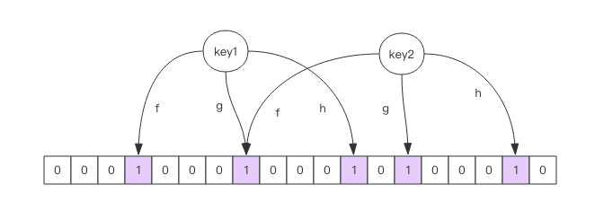
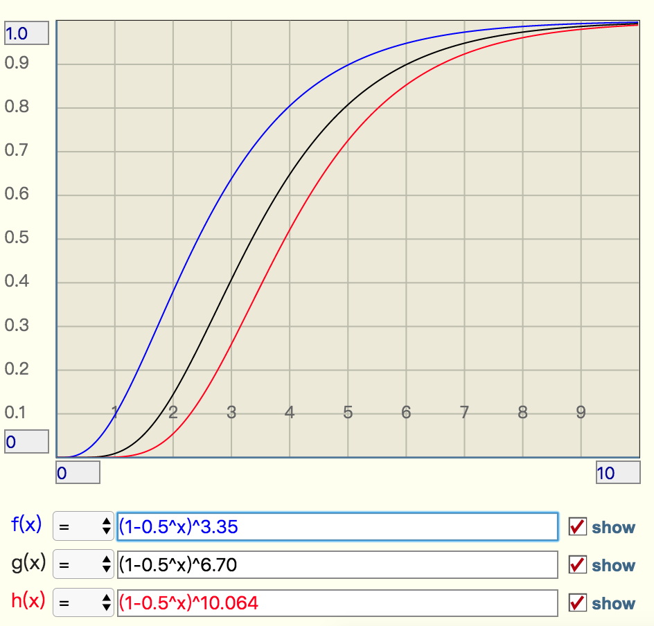

# Bloom Filter
如果我们想知道某一个值是不是已经在 HyperLogLog 结构里面了

新闻客户端推荐系统如何实现推送去重？

- 数据库exists性能瓶颈
- 缓存set浪费内存

布隆过滤器 (Bloom Filter) 闪亮登场了，它就是专门用来解决这种去重问题的。
它在起到去重的同时，在空间上还能节省 90% 以上，只是稍微有那么点不精确，也就是有一定的误判概率。

## 简介
当布隆过滤器说某个值存在时，这个值可能不存在；
当它说不存在时，那就肯定不存在。

Redis 官方提供的布隆过滤器到了 Redis 4.0 提供了插件功能之后才正式登场。布隆过滤器作为一个插件加载到 Redis Server 中，
给 Redis 提供了强大的布隆去重功能。
```shell script
$ docker pull redislabs/rebloom
$ docker run -p6679:6379 -d redislabs/rebloom
1:C 22 May 2020 02:49:04.210 # oO0OoO0OoO0Oo Redis is starting oO0OoO0OoO0Oo
1:C 22 May 2020 02:49:04.210 # Redis version=5.0.8, bits=64, commit=00000000, modified=0, pid=1, just started
1:C 22 May 2020 02:49:04.210 # Configuration loaded
1:M 22 May 2020 02:49:04.211 * Running mode=standalone, port=6379.
1:M 22 May 2020 02:49:04.211 # WARNING: The TCP backlog setting of 511 cannot be enforced because /proc/sys/net/core/somaxconn is set to the lower value of 128.
1:M 22 May 2020 02:49:04.211 # Server initialized
1:M 22 May 2020 02:49:04.211 # WARNING you have Transparent Huge Pages (THP) support enabled in your kernel. This will create latency and memory usage issues with Redis. To fix this issue run the command 'echo never > /sys/kernel/mm/transparent_hugepage/enabled' as root, and add it to your /etc/rc.local in order to retain the setting after a reboot. Redis must be restarted after THP is disabled.
1:M 22 May 2020 02:49:04.211 * Module 'bf' loaded from /usr/lib/redis/modules/redisbloom.so
1:M 22 May 2020 02:49:04.212 * Ready to accept connections

$ redis-cli -p 6679
```

Redis 4.0 之前也有第三方的布隆过滤器 lib 使用，只不过在实现上使用 redis 的位图来实现的，性能上也要差不少。
比如一次 exists 查询会涉及到多次 getbit 操作，网络开销相比而言会高出不少。
另外在实现上这些第三方 lib 也不尽完美，比如 pyrebloom 库就不支持重连和重试，在使用时需要对它做一层封装后才能在生产环境中使用。

[Python Redis Bloom Filter](https://github.com/seomoz/pyreBloom)

## 使用
### 命令
- bf.add key ...options...

- bf.madd key ...options...

- bf.exists key ...options...

- bf.mexists key ...options...

add和query的时间复杂度都为O(k)，与集合中元素的多少无关
### 误判
使用脚本添加多个元素试试，执行bloomfilter.py第一段代码发现没有误判

原因就在于布隆过滤器对于已经见过的元素肯定不会误判，它只会误判那些没见过的元素。
所以我们要稍微改一下bloomfilter.py脚本，使用 bf.exists 去查找没见过的元素，看看它是不是以为自己见过了。

执行bloomfilter.py脚本第二段，得到310。说明user311它误判存在数据库中，实际上user311并不存在数据库中。

#### 误判率
```shell script
Franks-Mac:playRedis frank$ python2 5.bloomfilter/misjudge_rate.py 
('total users', 100000)
all trained
(503, 50000)

```
503/50000=0.01006

#### 降低误判率
Redis 其实还提供了自定义参数的布隆过滤器，需要我们在 add 之前使用bf.reserve指令显式创建。如果对应的 key 已经存在，bf.reserve会报错。
bf.reserve有三个参数，分别是 key, error_rate和initial_size。错误率越低，需要的空间越大。
initial_size参数表示预计放入的元素数量，当实际数量超出这个数值时，误判率会上升。

所以需要提前设置一个较大的数值避免超出导致误判率升高。如果不使用 bf.reserve，默认的error_rate是 0.01，默认的initial_size是 100。

- bf.reserve key ...options...
```shell script
127.0.0.1:6679> bf.reserve codehole 0.001 1000
(error) ERR item exists
127.0.0.1:6679> 
127.0.0.1:6679> bf.reserve newkey 0.001 1000
OK

```

```shell script
Franks-Mac:playRedis frank$ python2 5.bloomfilter/bfreserve.py 
('total users', 100000)
all trained
(22, 50000)

```
22/50000=0.00044

我们看到了误判率大约 0.044%，比预计的 0.1% 低很多，不过布隆的概率是有误差的，只要不比预计误判率高太多，都是正常现象。

## 注意事项
布隆过滤器的initial_size估计的过大，会浪费存储空间，估计的过小，就会影响准确率，
用户在使用之前一定要尽可能地精确估计好元素数量，还需要加上一定的冗余空间以避免实际元素可能会意外高出估计值很多。

布隆过滤器的error_rate越小，需要的存储空间就越大，对于不需要过于精确的场合，error_rate设置稍大一点也无伤大雅。
比如在新闻去重上而言，误判率高一点只会让小部分文章不能让合适的人看到，文章的整体阅读量不会因为这点误判率就带来巨大的改变。

## BloomFilter的原理

每个布隆过滤器对应到 Redis 的数据结构里面就是一个大型的位数组和几个不一样的无偏 hash 函数。所谓无偏就是能够把元素的 hash 值算得比较均匀。

向布隆过滤器中添加 key 时，会使用多个 hash 函数对 key 进行 hash 算得一个整数索引值然后对位数组长度进行取模运算得到一个位置，
每个 hash 函数都会算得一个不同的位置。再把位数组的这几个位置都置为 1 就完成了 add 操作。

向布隆过滤器询问 key 是否存在时，跟 add 一样，也会把 hash 的几个位置都算出来，看看位数组中这几个位置是否都为 1，
只要有一个位为 0，那么说明布隆过滤器中这个 key 不存在。
如果都是 1，这并不能说明这个 key 就一定存在，只是极有可能存在，因为这些位被置为 1 可能是因为其它的 key 存在所致。
如果这个位数组比较稀疏，判断正确的概率就会很大，如果这个位数组比较拥挤，判断正确的概率就会降低。

不允许remove元素，因为那样的话会把相应的k个bits位置为0，而其中很有可能有其他元素对应的位。
因此remove会引入false negative(漏报)，这是绝对不被允许的。


当add的元素过多时，即n/m过大时（n是元素数，m是bloom filter的bits数），会导致false positive(误报)过高，此时就需要重新组建filter
使用时不要让实际元素远大于初始化大小，当实际元素开始超出初始化大小时，应该对布隆过滤器进行重建，重新分配一个 size 更大的过滤器，
再将所有的历史元素批量 add 进去 (这就要求我们在其它的存储器中记录所有的历史元素)。
因为 error_rate 不会因为数量超出就急剧增加，这就给我们重建过滤器提供了较为宽松的时间。

## 空间占用估计
几个变量：
- 预计元素的数量 n
- 错误率 f
- 位数组的长度 l，也就是需要的存储空间大小 (bit)
- hash 函数的最佳数量 k

他们之间的关系：
```
k=0.7*(l/n)  # 约等于
f=0.6185^(l/n)  # ^ 表示次方计算，也就是 math.pow

0.6185^0.2=0.9083807887
0.6185^2=0.38254225
0.6185**8=0.02141497796
l比n越大，需要k越大，导致f越小
```
- 位数组相对越长 (l/n)，错误率 f 越低，这个和直观上理解是一致的
- 位数组相对越长 (l/n)，hash 函数需要的最佳数量也越多，影响计算效率
- 当一个元素平均需要 1 个字节 (8bit) 的指纹空间时 (l/n=8)，错误率大约为 2%
- 错误率为 10%，一个元素需要的平均指纹空间为 4.792 个 bit，大约为 5bit，k为3.3544
- 错误率为 1%，一个元素需要的平均指纹空间为 9.585 个 bit，大约为 10bit，k为6.7095
- 错误率为 0.1%，一个元素需要的平均指纹空间为 14.377 个 bit，大约为 15bit，k为10.0639

[Bloom Filter Caculator](https://krisives.github.io/bloom-calculator/)

## 实际元素超出时，误判率会怎样变化
- 引入参数 t 表示实际元素和预计元素的倍数
- k 是 hash 函数的最佳数量
```
f=(1-0.5^t)^k  # 极限近似
```
当 t 增大时，错误率，f 也会跟着增大，分别选择错误率为 10%,1%,0.1% 的 k 值(3.3544,6.7095,10.0639)，画出它的曲线进行直观观察

- 错误率为 10% 时，倍数比为 2 时，错误率就会升至接近 40%，这个就比较危险了
- 错误率为 1% 时，倍数比为 2 时，错误率升至 15%，也挺可怕的
- 错误率为 0.1%，倍数比为 2 时，错误率升至 5%，也比较悬了

## 布隆过滤器的其它应用
- 爬虫系统过滤爬过的网页URL，只是会错过少量页面
- 作为数据库查询的前置过滤，降低数据库的磁盘IO
- 垃圾邮件过滤

## reference
[Bloom Filter](https://www.cnblogs.com/allensun/archive/2011/02/16/1956532.html)