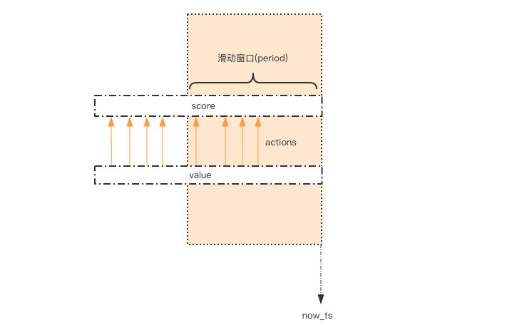

# Restrict
系统要限定用户的某个行为在指定的时间里只能允许发生 N 次，如何使用 Redis 的数据结构来实现这个限流的功能？

## string+ttl實現
```python
# coding:utf-8
import redis
import time

client = redis.StrictRedis(port=6479, charset="utf-8", decode_responses=True)


# 指定用户 user_id 的某个行为 action_key 在特定的时间内 period 只允许发生一定的次数 max_count
def is_action_allowed(user_id, action_key, period, max_count):
    key = user_id + action_key
    result = client.exists(key)
    if result:
        count = client.get(key)
        # count = int.from_bytes(count, 'big')
        count = int(count)
        if count > 0:
            client.incrby(key, -1)
            return True
    else:
        client.setex(key, period, max_count - 1)
        return True
    return False


# 调用这个接口 , 一分钟内只允许最多回复 5 个帖子
# can_reply = is_action_allowed("laoqian", "reply", 60, 5)
# if can_reply:
#     do_reply()
# else:
#     raise ActionThresholdOverflow()

for i in range(60):
    print(is_action_allowed("laoqian", "reply", 20, 5))
    time.sleep(1)

```
相對下面zset的方案來說節省空間

## zset的score限流
这个限流需求中存在一个滑动时间窗口，想想 zset 数据结构的 score 值，是不是可以通过 score 来圈出这个时间窗口来。
而且我们只需要保留这个时间窗口，窗口之外的数据都可以砍掉。那这个 zset 的 value 填什么比较合适呢？它只需要保证唯一性即可，
用 uuid 会比较浪费空间，那就改用毫秒时间戳吧。

```python
# coding: utf8
import time
import redis

client = redis.StrictRedis(port=6479)


def is_action_allowed(user_id, action_key, period, max_count):
    key = 'hist:%s:%s' % (user_id, action_key)
    now_ts = int(time.time() * 1000)  # 毫秒时间戳
    with client.pipeline() as pipe:  # client 是 StrictRedis 实例
        # 记录行为
        pipe.zadd(key, {now_ts: now_ts})  # value 和 score 都使用毫秒时间戳
        # 移除时间窗口之前的行为记录，剩下的都是时间窗口内的
        pipe.zremrangebyscore(key, 0, now_ts - period * 1000)
        # 获取窗口内的行为数量
        pipe.zcard(key)
        # 设置 zset 过期时间，避免冷用户持续占用内存
        # 过期时间应该等于时间窗口的长度，再多宽限 1s
        pipe.expire(key, period + 1)
        # 批量执行
        _, _, current_count, _ = pipe.execute()
    # 比较数量是否超标
    return current_count <= max_count


for i in range(60):
    print(is_action_allowed("laoqian", "reply2", 20, 5))
    time.sleep(1)

```
因为这几个连续的 Redis 操作都是针对同一个 key 的，使用 pipeline 可以显著提升 Redis 存取效率。
但这种方案也有缺点，因为它要记录时间窗口内所有的行为记录，如果这个量很大，比如限定 60s 内操作不得超过 100w 次这样的参数，
它是不适合做这样的限流的，因为会消耗大量的存储空间。

## funnel restrict
如果漏嘴流水的速率大于灌水的速率，那么漏斗永远都装不满。如果漏嘴流水速率小于灌水的速率，那么一旦漏斗满了，灌水就需要暂停并等待漏斗腾空。

漏斗的剩余空间就代表着当前行为可以持续进行的数量，漏嘴的流水速率代表着系统允许该行为的最大频率。
```python
# coding: utf8
import time


class Funnel(object):

    def __init__(self, capacity, leaking_rate):
        self.capacity = capacity  # 漏斗容量
        self.leaking_rate = leaking_rate  # 漏嘴流水速率
        self.left_quota = capacity  # 漏斗剩余空间
        self.leaking_ts = time.time()  # 上一次漏水时间

    def make_space(self):
        now_ts = time.time()
        delta_ts = now_ts - self.leaking_ts  # 距离上一次漏水过去了多久
        delta_quota = delta_ts * self.leaking_rate  # 又可以腾出不少空间了
        if delta_quota < 1:  # 腾的空间太少，那就等下次吧
            return
        self.left_quota += delta_quota  # 增加剩余空间
        self.leaking_ts = now_ts  # 记录漏水时间
        if self.left_quota > self.capacity:  # 剩余空间不得高于容量
            self.left_quota = self.capacity

    def watering(self, quota):
        self.make_space()
        if self.left_quota >= quota:  # 判断剩余空间是否足够
            self.left_quota -= quota
            return True
        return False


funnels = {}  # 所有的漏斗


# capacity  漏斗容量
# leaking_rate 漏嘴流水速率 quota/s
def is_action_allowed(user_id, action_key, capacity, leaking_rate):
    key = '%s:%s' % (user_id, action_key)
    funnel = funnels.get(key)
    if not funnel:
        funnel = Funnel(capacity, leaking_rate)
        funnels[key] = funnel
    return funnel.watering(1)


for i in range(20):
    print(is_action_allowed('laoqian', 'reply', 3, 0.5))
    time.sleep(1)

```
Funnel 对象的 make_space 方法是漏斗算法的核心，其在每次灌水前都会被调用以触发漏水，给漏斗腾出空间来。
能腾出多少空间取决于过去了多久以及流水的速率。Funnel 对象占据的空间大小不再和行为的频率成正比，它的空间占用是一个常量。

分布式的漏斗算法该如何实现？能不能使用 Redis 的基础数据结构来搞定？

我们观察 Funnel 对象的几个字段，我们发现可以将 Funnel 对象的内容按字段存储到一个 hash 结构中，
灌水的时候将 hash 结构的字段取出来进行逻辑运算后，再将新值回填到 hash 结构中就完成了一次行为频度的检测。

但是有个问题，我们无法保证整个过程的原子性。从 hash 结构中取值，然后在内存里运算，再回填到 hash 结构，这三个过程无法原子化，
意味着需要进行适当的加锁控制。而一旦加锁，就意味着会有加锁失败，加锁失败就需要选择重试或者放弃。

如果重试的话，就会导致性能下降。如果放弃的话，就会影响用户体验。同时，代码的复杂度也跟着升高很多。
这真是个艰难的选择，我们该如何解决这个问题呢？

## Redis-Cell
Redis 4.0 提供了一个限流 Redis 模块，它叫 redis-cell。该模块也使用了漏斗算法，并提供了原子的限流指令。有了这个模块，限流问题就非常简单了。

该模块只有1条指令cl.throttle，它的参数和返回值都略显复杂，接下来让我们来看看这个指令具体该如何使用。

[](https://github.com/brandur/redis-cell)

```shell script
> cl.throttle laoqian:reply 15 30 60 1
                      ▲     ▲  ▲  ▲  ▲
                      |     |  |  |  └───── need 1 quota (可选参数，默认值也是1)
                      |     |  └──┴─────── 30 operations / 60 seconds 这是漏水速率
                      |     └───────────── 15 capacity 这是漏斗容量
                      └─────────────────── key laoqian

> cl.throttle laoqian:reply 15 30 60
1) (integer) 0   # 0 表示允许，1表示拒绝
2) (integer) 15  # 漏斗容量capacity
3) (integer) 14  # 漏斗剩余空间left_quota
4) (integer) -1  # 如果拒绝了，需要多长时间后再试(漏斗有空间了，单位秒)
5) (integer) 2   # 多长时间后，漏斗完全空出来(left_quota==capacity，单位秒)
```

在redis-cli中查看redis版本等信息
```shell script
127.0.0.1:6679> info
# Server
redis_version:5.0.8
redis_git_sha1:00000000
redis_git_dirty:0
redis_build_id:ce75a617c591114f
redis_mode:standalone
os:Linux 4.9.125-linuxkit x86_64
arch_bits:64
multiplexing_api:epoll
atomicvar_api:atomic-builtin
gcc_version:8.3.0
process_id:1
run_id:c5dadd51bb60a3183c73d9f5254942236fe35510
tcp_port:6379
uptime_in_seconds:257172
uptime_in_days:2
hz:10
configured_hz:10
lru_clock:13317142
executable:/data/redis-server
config_file:

# Clients
connected_clients:1
client_recent_max_input_buffer:2
client_recent_max_output_buffer:0
blocked_clients:0

# Memory
used_memory:977456
used_memory_human:954.55K
used_memory_rss:5185536
used_memory_rss_human:4.95M
used_memory_peak:1016144
used_memory_peak_human:992.33K
used_memory_peak_perc:96.19%
used_memory_overhead:847270
used_memory_startup:797464
used_memory_dataset:130186
used_memory_dataset_perc:72.33%
allocator_allocated:991472
allocator_active:1159168
allocator_resident:3829760
total_system_memory:2095869952
total_system_memory_human:1.95G
used_memory_lua:37888
used_memory_lua_human:37.00K
used_memory_scripts:0
used_memory_scripts_human:0B
number_of_cached_scripts:0
maxmemory:0
maxmemory_human:0B
maxmemory_policy:noeviction
allocator_frag_ratio:1.17
allocator_frag_bytes:167696
allocator_rss_ratio:3.30
allocator_rss_bytes:2670592
rss_overhead_ratio:1.35
rss_overhead_bytes:1355776
mem_fragmentation_ratio:5.54
mem_fragmentation_bytes:4250040
mem_not_counted_for_evict:0
mem_replication_backlog:0
mem_clients_slaves:0
mem_clients_normal:49694
mem_aof_buffer:0
mem_allocator:jemalloc-5.1.0
active_defrag_running:0
lazyfree_pending_objects:0

# Persistence
loading:0
rdb_changes_since_last_save:100003
rdb_bgsave_in_progress:0
rdb_last_save_time:1590118274
rdb_last_bgsave_status:ok
rdb_last_bgsave_time_sec:-1
rdb_current_bgsave_time_sec:-1
rdb_last_cow_size:0
aof_enabled:0
aof_rewrite_in_progress:0
aof_rewrite_scheduled:0
aof_last_rewrite_time_sec:-1
aof_current_rewrite_time_sec:-1
aof_last_bgrewrite_status:ok
aof_last_write_status:ok
aof_last_cow_size:0

# Stats
total_connections_received:3
total_commands_processed:200006
instantaneous_ops_per_sec:0
total_net_input_bytes:20500354
total_net_output_bytes:800144
instantaneous_input_kbps:0.00
instantaneous_output_kbps:0.00
rejected_connections:0
sync_full:0
sync_partial_ok:0
sync_partial_err:0
expired_keys:0
expired_stale_perc:0.00
expired_time_cap_reached_count:0
evicted_keys:0
keyspace_hits:100001
keyspace_misses:0
pubsub_channels:0
pubsub_patterns:0
latest_fork_usec:0
migrate_cached_sockets:0
slave_expires_tracked_keys:0
active_defrag_hits:0
active_defrag_misses:0
active_defrag_key_hits:0
active_defrag_key_misses:0

# Replication
role:master
connected_slaves:0
master_replid:baedebd8b9c2858c1f54aaf723fe53dd4a0d6c09
master_replid2:0000000000000000000000000000000000000000
master_repl_offset:0
second_repl_offset:-1
repl_backlog_active:0
repl_backlog_size:1048576
repl_backlog_first_byte_offset:0
repl_backlog_histlen:0

# CPU
used_cpu_sys:226.850000
used_cpu_user:53.420000
used_cpu_sys_children:0.000000
used_cpu_user_children:0.000000

# Cluster
cluster_enabled:0

# Keyspace
db0:keys=2,expires=0,avg_ttl=0

127.0.0.1:6679> info cpu
# CPU
used_cpu_sys:227.320000
used_cpu_user:53.500000
used_cpu_sys_children:0.000000
used_cpu_user_children:0.000000

```

