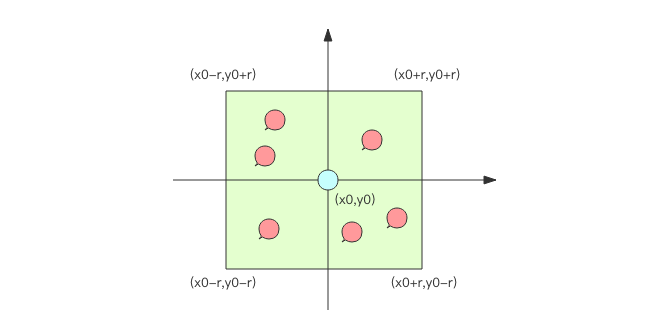

# GeoHash

## 用数据库来计算附近的人
当两个元素的距离不是很远时，可以直接使用勾股定理就能算得元素之间的距离。我们平时使用的「附近的人」的功能，元素距离都不是很大，勾股定理算距离足矣。
不过需要注意的是，经纬度坐标的密度不一样 (地球是一个椭圆)，勾股定律计算平方差时之后再求和时，需要按一定的系数比加权求和，如果不求精确的话，也可以不必加权。

现在，如果要计算「附近的人」，也就是给定一个元素的坐标，然后计算这个坐标附近的其它元素，按照距离进行排序，该如何下手？



首先，你不可能通过遍历来计算所有的元素和目标元素的距离然后再进行排序，这个计算量太大了，性能指标肯定无法满足。
一般的方法都是通过矩形区域来限定元素的数量，然后对区域内的元素进行全量距离计算再排序。这样可以明显减少计算量
```
select id from positions where x0-r < x < x0+r and y0-r < y < y0+r
```

## GeoHash算法

业界比较通用的地理位置距离排序算法是 GeoHash 算法，Redis 也使用 GeoHash 算法。GeoHash 算法将二维的经纬度数据映射到一维的整数，
这样所有的元素都将在挂载到一条线上，距离靠近的二维坐标映射到一维后的点之间距离也会很接近。当我们想要计算「附近的人时」，
首先将目标位置映射到这条线上，然后在这个一维的线上获取附近的点就行了。

那这个映射算法具体是怎样的呢？它将整个地球看成一个二维平面，然后划分成了一系列正方形的方格，就好比围棋棋盘。
所有的地图元素坐标都将放置于唯一的方格中。方格越小，坐标越精确。然后对这些方格进行整数编码，越是靠近的方格编码越是接近。
那如何编码呢？一个最简单的方案就是切蛋糕法。设想一个正方形的蛋糕摆在你面前，二刀下去均分分成四块小正方形，
这四个小正方形可以分别标记为 00,01,10,11 四个二进制整数。然后对每一个小正方形继续用二刀法切割一下，
这时每个小小正方形就可以使用 4bit 的二进制整数予以表示。然后继续切下去，正方形就会越来越小，二进制整数也会越来越长，精确度就会越来越高。


编码之后，每个地图元素的坐标都将变成一个整数，通过这个整数可以还原出元素的坐标，整数越长，还原出来的坐标值的损失程度就越小。

这个整数长得如下所示4069154033428715，4069880904286516 等
```shell script
127.0.0.1:6679> zrange company 0 -1 withscores
 1) "jd"
 2) "4069154033428715"
 3) "xiaomi"
 4) "4069880904286516"
 5) "ireader"
 6) "4069886008361398"
 7) "juejin"
 8) "4069887154388167"
 9) "meituan"
10) "4069887179083478"
127.0.0.1:6679> georadiusbymember company ireader 20 km count 3 desc withhash
1) 1) "jd"
   2) (integer) 4069154033428715
2) 1) "meituan"
   2) (integer) 4069887179083478
3) 1) "juejin"
   2) (integer) 4069887154388167
```
GeoHash 算法会继续对这个整数做一次 base32 编码 (0-9,a-z 去掉 a,i,l,o 四个字母) 变成一个字符串。
在 Redis 里面，经纬度使用 52 位的整数进行编码，放进了 zset 里面，zset 的 value 是元素的 key，score 是 GeoHash 的 52 位整数值。
zset 的 score 虽然是浮点数，但是对于 52 位的整数值，它可以无损存储。

这个52没搞懂，例如下面示例中juejin的坐标经纬度值 116.48104995489120483 39.99679348858259686 才41位长度

hash值长得如wx4g52e1ce0这样：
```shell script
127.0.0.1:6679> geohash company ireader
1) "wx4g52e1ce0"
127.0.0.1:6679> 
127.0.0.1:6679> geohash company juejin
1) "wx4gd94yjn0"
127.0.0.1:6679> 
127.0.0.1:6679> geohash company xiaomi
1) "wx4exqb0880"
```

在使用 Redis 进行 Geo 查询时，我们要时刻想到它的内部结构实际上只是一个 zset(skiplist)。
通过 zset 的 score 排序就可以得到坐标附近的其它元素 (实际情况要复杂一些，不过这样理解足够了)，
通过将 score 还原成坐标值就可以得到元素的原始坐标。

## Redis 的 Geo 指令基本使用
命令介绍
````
添加
geoadd key longitude latitude member [longitude latitude member ...]
前面我们提到 geo 存储结构上使用的是 zset，意味着我们可以使用 zset 相关的指令来操作 geo 数据，所以删除指令可以直接使用 zrem 指令即可。

两个元素之间距离，距离单位可以是 m、km、ml、ft，分别代表米、千米、英里和尺。
geodist key member1 member2 [unit]

获取元素位置，获取的经纬度坐标和 geoadd 进去的坐标有轻微的误差，原因是 geohash 对二维坐标进行的一维映射是有损的，通过映射再还原回来的值会出现较小的差别。
geopos key member [member ...]

获取元素的hash值，相同的坐标计算出此值唯一。此hash值代入后面这个网站url后可以获取到具体坐标：http://geohash.org/wx4gd94yjn0
geohash key member [member ...]

根据元素附近的元素
georadiusbymember key member radius m|km|ft|mi [WITHCOORD] [WITHDIST] [WITHHASH] [COUNT count] [ASC|DESC] [STORE key] [STOREDIST key]

根据坐标获取附近的元素
georadius key longitude latitude radius m|km|ft|mi [WITHCOORD] [WITHDIST] [WITHHASH] [COUNT count] [ASC|DESC] [STORE key] [STOREDIST key]
````


实践
```shell script
127.0.0.1:6679> geoadd company 116.48105 39.996794 juejin
(integer) 1
127.0.0.1:6679> geoadd company 116.514203 39.905409 ireader
(integer) 1
127.0.0.1:6679> geoadd company 116.489033 40.007669 meituan
(integer) 1
127.0.0.1:6679> geoadd company 116.562108 39.787602 jd 116.334255 40.027400 xiaomi
(integer) 2
127.0.0.1:6679> 
127.0.0.1:6679> geodist company juejin ireader km
"10.5501"
127.0.0.1:6679> geodist company juejin xiaomi km
"12.9606"
127.0.0.1:6679> geodist company juejin meituan km
"1.3878"
127.0.0.1:6679> geodist company juejin jd km
"24.2739"
127.0.0.1:6679> geodist company juejin jd m
"24273.9390"
127.0.0.1:6679> 
127.0.0.1:6679> geopos company juejin
1) 1) "116.48104995489120483"
   2) "39.99679348858259686"
127.0.0.1:6679> 
127.0.0.1:6679> 
127.0.0.1:6679> geopos company juejin ireader
1) 1) "116.48104995489120483"
   2) "39.99679348858259686"
2) 1) "116.5142020583152771"
   2) "39.90540918662494363"
127.0.0.1:6679> 
127.0.0.1:6679> geohash company ireader
1) "wx4g52e1ce0"
127.0.0.1:6679> 
127.0.0.1:6679> geohash company juejin
1) "wx4gd94yjn0"
127.0.0.1:6679> 
127.0.0.1:6679> geohash company xiaomi
1) "wx4exqb0880"
127.0.0.1:6679> zrange company 0 -1 
1) "jd"
2) "xiaomi"
3) "ireader"
4) "juejin"
5) "meituan"
127.0.0.1:6679> zrange company 0 -1 withscores
 1) "jd"
 2) "4069154033428715"
 3) "xiaomi"
 4) "4069880904286516"
 5) "ireader"
 6) "4069886008361398"
 7) "juejin"
 8) "4069887154388167"
 9) "meituan"
10) "4069887179083478"
127.0.0.1:6679> 
127.0.0.1:6679> georadiusbymember company ireader 20 km count 3 asc
1) "ireader"
2) "juejin"
3) "meituan"
127.0.0.1:6679> georadiusbymember company ireader 2 km count 3 asc
1) "ireader"
127.0.0.1:6679> 
127.0.0.1:6679> georadiusbymember company ireader 20 km count 3 desc
1) "jd"
2) "meituan"
3) "juejin"
127.0.0.1:6679> georadiusbymember company ireader 2 km count 3 asc
1) "ireader"
127.0.0.1:6679> 
127.0.0.1:6679> georadiusbymember company ireader 20 km count 3 desc
1) "jd"
2) "meituan"
3) "juejin"
127.0.0.1:6679> georadiusbymember company ireader 20 km count 3 desc withcoord
1) 1) "jd"
   2) 1) "116.56210631132125854"
      2) "39.78760295130235392"
2) 1) "meituan"
   2) 1) "116.48903220891952515"
      2) "40.00766997707732031"
3) 1) "juejin"
   2) 1) "116.48104995489120483"
      2) "39.99679348858259686"
127.0.0.1:6679> 
127.0.0.1:6679> georadiusbymember company ireader 20 km count 3 desc withdist
1) 1) "jd"
   2) "13.7269"
2) 1) "meituan"
   2) "11.5748"
3) 1) "juejin"
   2) "10.5501"
127.0.0.1:6679> georadiusbymember company ireader 20 km count 3 desc withhash
1) 1) "jd"
   2) (integer) 4069154033428715
2) 1) "meituan"
   2) (integer) 4069887179083478
3) 1) "juejin"
   2) (integer) 4069887154388167
127.0.0.1:6679> 
127.0.0.1:6679> georadius company 116.514 39.905 20 km withdist count 3 asc
1) 1) "ireader"
   2) "0.0487"
2) 1) "juejin"
   2) "10.5894"
3) 1) "meituan"
   2) "11.6163"
127.0.0.1:6679> 

```

## 小结 & 注意事项
在一个地图应用中，车的数据、餐馆的数据、人的数据可能会有百万千万条，如果使用 Redis 的 Geo 数据结构，它们将全部放在一个 zset 集合中。
在 Redis 的集群环境中，集合可能会从一个节点迁移到另一个节点，如果单个 key 的数据过大，会对集群的迁移工作造成较大的影响，
在集群环境中单个 key 对应的数据量不宜超过 1M，否则会导致集群迁移出现卡顿现象，影响线上服务的正常运行。

所以，这里建议 Geo 的数据使用单独的 Redis 实例部署，不使用集群环境。

如果数据量过亿甚至更大，就需要对 Geo 数据进行拆分，按国家拆分、按省拆分，按市拆分，在人口特大城市甚至可以按区拆分。
这样就可以显著降低单个 zset 集合的大小。