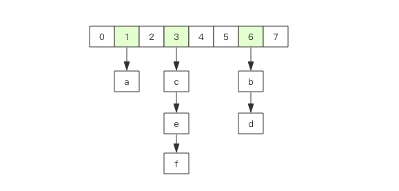
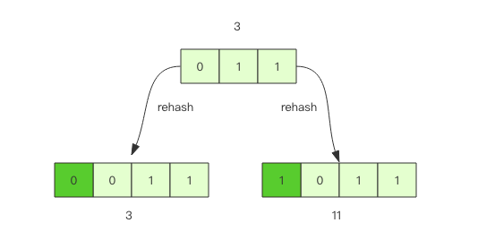
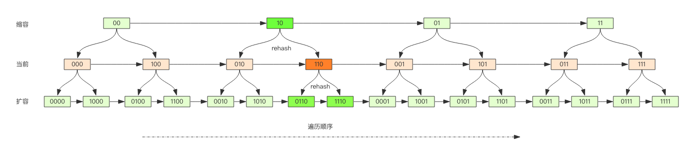

# Scan
如何从海量的 key 中找出满足特定前缀的 key 列表来？

使用 keys 列出所有满足特定正则字符串规则的 key。
```shell script
keys *
keys codehole*
keys code*hole
```
但是这个命令有很明显的两个缺点：
- 没有 offset、limit 参数，一次性吐出所有满足条件的 key，万一实例中有几百 w 个 key 满足条件，
    当你看到满屏的字符串刷的没有尽头时，你就知道难受了。
- keys 算法是遍历算法，复杂度是 O(n)，如果实例中有千万级以上的 key，这个指令就会导致 Redis 服务卡顿，
    所有读写 Redis 的其它的指令都会被延后甚至会超时报错，因为 Redis 是单线程程序，顺序执行所有指令，
    其它指令必须等到当前的 keys 指令执行完了才可以继续。

Redis 为了解决这个问题，它在 2.8 版本中加入了大海捞针的指令——scan。scan 相比 keys 具备有以下特点:

- 复杂度虽然也是 O(n)，但是它是通过游标分步进行的，不会阻塞线程;
- 提供 limit 参数，可以控制每次返回结果的最大条数，limit 只是一个 hint，返回的结果可多可少;
- 同 keys 一样，它也提供模式匹配功能;
- 服务器不需要为游标保存状态，游标的唯一状态就是 scan 返回给客户端的游标整数;
- 返回的结果可能会有重复，需要客户端去重复，这点非常重要;
- 遍历的过程中如果有数据修改，改动后的数据能不能遍历到是不确定的;
- 单次返回的结果是空的并不意味着遍历结束，而要看返回的游标值是否为零;

## 使用
```shell script
scan cursor [MATCH pattern] [COUNT count]
```
scan 参数提供了三个参数，第一个是 cursor 整数值，第二个是 key 的正则模式，第三个是遍历的 limit hint。第一次遍历时，cursor 值为 0，
然后将返回结果中第一个整数值作为下一次遍历的 cursor。一直遍历到返回的 cursor 值为 0 时结束。

执行 python dump_data.py倒入数据
```shell script
127.0.0.1:6679> scan 0 match key99* count 12
1) "10752"
2) 1) "key9970"
127.0.0.1:6679> scan 0 match key99* count 1000
1) "536"
2) 1) "key9970"
   2) "key9987"
   3) "key9965"
   4) "key9935"
   5) "key9978"
   6) "key9904"
   7) "key9946"
127.0.0.1:6679> 
127.0.0.1:6679> scan 0 match key99* count 1000
1) "536"
2) 1) "key9970"
   2) "key9987"
   3) "key9965"
   4) "key9935"
   5) "key9978"
   6) "key9904"
   7) "key9946"
127.0.0.1:6679> scan 536 match key99* count 1000
1) "14092"
2)  1) "key9983"
    2) "key9923"
    3) "key9907"
    4) "key9934"
    5) "key994"
    6) "key9976"
    7) "key9944"
    8) "key9955"
    9) "key9968"
   10) "key9938"
   11) "key9953"
   12) "key9952"
   13) "key9960"
127.0.0.1:6679> scan 14092 match key99* count 1000
1) "8338"
2)  1) "key9922"
    2) "key9924"
    3) "key9975"
    4) "key9909"
    5) "key991"
    6) "key9997"
    7) "key9957"
    8) "key997"
    9) "key993"
   10) "key9972"
   11) "key9984"
127.0.0.1:6679> scan 8338 match key99* count 1000
1) "3654"
2)  1) "key9973"
    2) "key9948"
    3) "key9959"
    4) "key9926"
    5) "key9931"
    6) "key9913"
    7) "key9995"
    8) "key9943"
    9) "key9951"
   10) "key992"
127.0.0.1:6679> 

```
从上面的过程可以看到虽然提供的 limit 是 1000，但是返回的结果只有 10 个左右。因为这个 limit 不是限定返回结果的数量，
而是限定服务器单次遍历的字典槽位数量(约等于)

0 -> 536 -> 14092 -> 8338 -> 3654
可以看出cursor变化不是线性的，这与rehash有关。

## 字典的结构
在 Redis 中所有的 key 都存储在一个很大的字典中，这个字典的结构和 Java 中的 HashMap 一样，是一维数组 + 二维链表结构，
第一维数组的大小总是 2^n(n>=0)，扩容一次数组大小空间加倍，也就是 n++。



scan 指令返回的游标就是第一维数组的位置索引，我们将这个位置索引称为槽 (slot)。如果不考虑字典的扩容缩容，直接按数组下标挨个遍历就行了。
limit 参数就表示需要遍历的槽位数，之所以返回的结果可能多可能少，是因为不是所有的槽位上都会挂接链表，有些槽位可能是空的，
还有些槽位上挂接的链表上的元素可能会有多个。每一次遍历都会将 limit 数量的槽位上挂接的所有链表元素进行模式匹配过滤后，一次性返回给客户端。

## scan 遍历顺序
scan 的遍历顺序非常特别。它不是从第一维数组的第 0 位一直遍历到末尾，而是采用了高位进位加法来遍历。
之所以使用这样特殊的方式进行遍历，是考虑到字典的扩容和缩容时避免槽位的遍历重复和遗漏。

首先我们用动画演示一下普通加法和高位进位加法的区别。


从动画中可以看出高位进位法从左边加，进位往右边移动，同普通加法正好相反。但是最终它们都会遍历所有的槽位并且没有重复。

## 字典扩容
什么是取模运算？就是获取整除后的余数

    7 % 4
    3
    -7 % 4
    1
    7 % -4
    -1
    -7 % -4
    -3

Java 中的 HashMap 有扩容的概念，当 loadFactor 达到阈值时，需要重新分配一个新的 2 倍大小的数组，
然后将所有的元素全部 rehash 挂到新的数组下面。rehash 就是将元素的 hash 值对数组长度进行取模运算，因为长度变了，
所以每个元素挂接的槽位可能也发生了变化。又因为数组的长度是 2^n 次方，所以取模运算等价于位与操作。
    
    a mod 8 = a & (8-1) = a & 7
    a mod 16 = a & (16-1) = a & 15
    a mod 32 = a & (32-1) = a & 31
    
这里的 7, 15, 31 称之为字典的 mask 值，mask 的作用就是保留 hash 值的低位，高位都被设置为 0。

接下来我们看看 rehash 前后元素槽位的变化。

假设当前的字典的数组长度由 8 位扩容到 16 位，那么 3 号槽位 011 将会被 rehash 到 3 号槽位和 11 号槽位，
也就是说该槽位链表中大约有一半的元素还是 3 号槽位，其它的元素会放到 11 号槽位，11 这个数字的二进制是 1011，
就是对 3 的二进制 011 增加了一个高位 1。



抽象一点说，假设开始槽位的二进制数是 xxx，那么该槽位中的元素将被 rehash 到 0xxx 和 1xxx(xxx+8) 中。 
如果字典长度由 16 位扩容到 32 位，那么对于二进制槽位 xxxx 中的元素将被 rehash 到 0xxxx 和 1xxxx(xxxx+16) 中。

## 对比扩容缩容前后的遍历顺序


观察这张图，我们发现采用高位进位加法的遍历顺序，rehash 后的槽位在遍历顺序上是相邻的。

假设当前要即将遍历 110 这个位置 (橙色)，那么扩容后，当前槽位上所有的元素对应的新槽位是 0110 和 1110(深绿色)，
也就是在槽位的二进制数增加一个高位 0 或 1。这时我们可以直接从 0110 这个槽位开始往后继续遍历，0110 槽位之前的所有槽位都是已经遍历过的，
这样就可以避免扩容后对已经遍历过的槽位进行重复遍历。

再考虑缩容，假设当前即将遍历 110 这个位置 (橙色)，那么缩容后，当前槽位所有的元素对应的新槽位是 10(深绿色)，也就是去掉槽位二进制最高位。
这时我们可以直接从 10 这个槽位继续往后遍历，10 槽位之前的所有槽位都是已经遍历过的，这样就可以避免缩容的重复遍历。
不过缩容还是不太一样，它会对图中 010 这个槽位上的元素进行重复遍历，因为缩融后 10 槽位的元素是 010 和 110 上挂接的元素的融合。

## 渐进式 rehash
Java 的 HashMap 在扩容时会一次性将旧数组下挂接的元素全部转移到新数组下面。如果 HashMap 中元素特别多，线程就会出现卡顿现象。
Redis 为了解决这个问题，它采用渐进式 rehash。

它会同时保留旧数组和新数组，然后在定时任务中以及后续对 hash 的指令操作中渐渐地将旧数组中挂接的元素迁移到新数组上。
这意味着要操作处于 rehash 中的字典，需要同时访问新旧两个数组结构。如果在旧数组下面找不到元素，还需要去新数组下面去寻找。

scan 也需要考虑这个问题，对于 rehash 中的字典，它需要同时扫描新旧槽位，然后将结果融合后返回给客户端。

## 更多的 scan 指令
scan 指令是一系列指令，除了可以遍历所有的 key 之外，还可以对指定的容器集合进行遍历。
比如 zscan 遍历 zset 集合元素，hscan 遍历 hash 字典的元素、sscan 遍历 set 集合的元素。

它们的原理同 scan 都会类似的，因为 hash 底层就是字典，set 也是一个特殊的 hash(所有的 value 指向同一个元素)，
zset 内部也使用了字典来存储所有的元素内容，所以这里不再赘述。

```shell script
scan cursor [MATCH pattern] [COUNT count]
zscan key cursor [MATCH pattern] [COUNT count]
hscan key cursor [MATCH pattern] [COUNT count]
sscan key cursor [MATCH pattern] [COUNT count]
```
## 大key扫描
在集群环境下，如果某个 key 太大，会数据导致迁移卡顿。另外在内存分配上，如果一个 key 太大，那么当它需要扩容时，会一次性申请更大的一块内存，
这也会导致卡顿。如果这个大 key 被删除，内存会一次性回收，卡顿现象会再一次产生。

如果你观察到 Redis 的内存大起大落，这极有可能是因为大 key 导致的，这时候你就需要定位出具体是那个 key，进一步定位出具体的业务来源，
然后再改进相关业务代码设计。

为了避免对线上 Redis 带来卡顿，这就要用到 scan 指令，对于扫描出来的每一个 key，使用 type 指令获得 key 的类型，
然后使用相应数据结构的 size 或者 len 方法来得到它的大小，对于每一种类型，保留大小的前 N 名作为扫描结果展示出来。

上面这样的过程需要编写脚本，比较繁琐，不过 Redis 官方已经在 redis-cli 指令中提供了这样的扫描功能，我们可以直接拿来即用。

redis-cli使用帮助
```shell script
Franks-Mac:playRedis frank$ redis-cli --help
redis-cli 5.0.5

Usage: redis-cli [OPTIONS] [cmd [arg [arg ...]]]
  -h <hostname>      Server hostname (default: 127.0.0.1).
  -p <port>          Server port (default: 6379).
  -s <socket>        Server socket (overrides hostname and port).
  -a <password>      Password to use when connecting to the server.
                     You can also use the REDISCLI_AUTH environment
                     variable to pass this password more safely
                     (if both are used, this argument takes predecence).
  -u <uri>           Server URI.
  -r <repeat>        Execute specified command N times.
  -i <interval>      When -r is used, waits <interval> seconds per command.
                     It is possible to specify sub-second times like -i 0.1.
  -n <db>            Database number.
  -x                 Read last argument from STDIN.
  -d <delimiter>     Multi-bulk delimiter in for raw formatting (default: \n).
  -c                 Enable cluster mode (follow -ASK and -MOVED redirections).
  --raw              Use raw formatting for replies (default when STDOUT is
                     not a tty).
  --no-raw           Force formatted output even when STDOUT is not a tty.
  --csv              Output in CSV format.
  --stat             Print rolling stats about server: mem, clients, ...
  --latency          Enter a special mode continuously sampling latency.
                     If you use this mode in an interactive session it runs
                     forever displaying real-time stats. Otherwise if --raw or
                     --csv is specified, or if you redirect the output to a non
                     TTY, it samples the latency for 1 second (you can use
                     -i to change the interval), then produces a single output
                     and exits.
  --latency-history  Like --latency but tracking latency changes over time.
                     Default time interval is 15 sec. Change it using -i.
  --latency-dist     Shows latency as a spectrum, requires xterm 256 colors.
                     Default time interval is 1 sec. Change it using -i.
  --lru-test <keys>  Simulate a cache workload with an 80-20 distribution.
  --replica          Simulate a replica showing commands received from the master.
  --rdb <filename>   Transfer an RDB dump from remote server to local file.
  --pipe             Transfer raw Redis protocol from stdin to server.
  --pipe-timeout <n> In --pipe mode, abort with error if after sending all data.
                     no reply is received within <n> seconds.
                     Default timeout: 30. Use 0 to wait forever.
  --bigkeys          Sample Redis keys looking for keys with many elements (complexity).
  --memkeys          Sample Redis keys looking for keys consuming a lot of memory.
  --memkeys-samples <n> Sample Redis keys looking for keys consuming a lot of memory.
                     And define number of key elements to sample
  --hotkeys          Sample Redis keys looking for hot keys.
                     only works when maxmemory-policy is *lfu.
  --scan             List all keys using the SCAN command.
  --pattern <pat>    Useful with --scan to specify a SCAN pattern.
  --intrinsic-latency <sec> Run a test to measure intrinsic system latency.
                     The test will run for the specified amount of seconds.
  --eval <file>      Send an EVAL command using the Lua script at <file>.
  --ldb              Used with --eval enable the Redis Lua debugger.
  --ldb-sync-mode    Like --ldb but uses the synchronous Lua debugger, in
                     this mode the server is blocked and script changes are
                     not rolled back from the server memory.
  --cluster <command> [args...] [opts...]
                     Cluster Manager command and arguments (see below).
  --verbose          Verbose mode.
  --no-auth-warning  Don't show warning message when using password on command
                     line interface.
  --help             Output this help and exit.
  --version          Output version and exit.

Cluster Manager Commands:
  Use --cluster help to list all available cluster manager commands.

Examples:
  cat /etc/passwd | redis-cli -x set mypasswd
  redis-cli get mypasswd
  redis-cli -r 100 lpush mylist x
  redis-cli -r 100 -i 1 info | grep used_memory_human:
  redis-cli --eval myscript.lua key1 key2 , arg1 arg2 arg3
  redis-cli --scan --pattern '*:12345*'

  (Note: when using --eval the comma separates KEYS[] from ARGV[] items)

When no command is given, redis-cli starts in interactive mode.
Type "help" in interactive mode for information on available commands
and settings.

```
具体使用
```shell script
Franks-Mac:playRedis frank$ redis-cli -p 6679 --bigkeys

# Scanning the entire keyspace to find biggest keys as well as
# average sizes per key type.  You can use -i 0.1 to sleep 0.1 sec
# per 100 SCAN commands (not usually needed).

[00.00%] Biggest string found so far 'key3692' with 4 bytes
[98.15%] Biggest zset   found so far 'company' with 6 members

-------- summary -------

Sampled 10003 keys in the keyspace!
Total key length in bytes is 68911 (avg len 6.89)

Biggest string found 'key3692' has 4 bytes
Biggest   zset found 'company' has 6 members

0 lists with 0 items (00.00% of keys, avg size 0.00)
0 hashs with 0 fields (00.00% of keys, avg size 0.00)
10000 strings with 38890 bytes (99.97% of keys, avg size 3.89)
0 streams with 0 entries (00.00% of keys, avg size 0.00)
0 sets with 0 members (00.00% of keys, avg size 0.00)
2 MBbloom--s with 0 ? (00.02% of keys, avg size 0.00)
1 zsets with 6 members (00.01% of keys, avg size 6.00)
Franks-Mac:playRedis frank$ 
```
如果你担心这个指令会大幅抬升 Redis 的 ops 导致线上报警，还可以增加一个休眠参数。
```shell script
Franks-Mac:playRedis frank$ redis-cli -p 6679 --bigkeys -i 0.1

# Scanning the entire keyspace to find biggest keys as well as
# average sizes per key type.  You can use -i 0.1 to sleep 0.1 sec
# per 100 SCAN commands (not usually needed).

[00.00%] Biggest string found so far 'key3692' with 4 bytes
[98.15%] Biggest zset   found so far 'company' with 6 members

-------- summary -------

Sampled 10003 keys in the keyspace!
Total key length in bytes is 68911 (avg len 6.89)

Biggest string found 'key3692' has 4 bytes
Biggest   zset found 'company' has 6 members

0 lists with 0 items (00.00% of keys, avg size 0.00)
0 hashs with 0 fields (00.00% of keys, avg size 0.00)
10000 strings with 38890 bytes (99.97% of keys, avg size 3.89)
0 streams with 0 entries (00.00% of keys, avg size 0.00)
0 sets with 0 members (00.00% of keys, avg size 0.00)
2 MBbloom--s with 0 ? (00.02% of keys, avg size 0.00)
1 zsets with 6 members (00.01% of keys, avg size 6.00)
Franks-Mac:playRedis frank$ 

```
上面这个指令每隔 100 条 scan 指令就会休眠 0.1s，ops 就不会剧烈抬升，但是扫描的时间会变长。

[扩展阅读](https://mp.weixin.qq.com/s/ufoLJiXE0wU4Bc7ZbE9cDQ)
